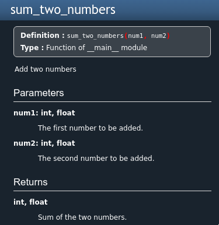

# Overview {#overview}


> It's still magic even if you know how it's done.
>
> — Terry Pratchett

FIXME: general introduction

-   Be able to do the steps in @Yenn2019.

## Why isn't all of this normal already? {#overview-against}

Nobody argues that research should be irreproducible or unsustainable,
but "not against it" and actively supporting it are very different things.
Academia doesn't yet know how to reward people for writing useful software,
so while you may be thanked,
the extra effort you put in may not translate into job security or decent pay.

And some people still argue against openness,
Being open is a big step toward a (non-academic) career path,
which is where approximately 80% of PhDs go,
and for those staying in academia,
open work is cited more often than closed (FIXME: citation).
However,
some people still worry that if they make their data and code generally available,
someone else will use it and publish a result they have come up with themselves.
This is almost unheard of in practice,
but that doesn't stop people using it as a boogeyman.

Other people are afraid of looking foolish or incompetent by sharing code that might contain bugs.
This isn't just [impostor syndrome][impostor-syndrome]:
members of marginalized groups are frequently judged more harshly than others (FIXME: citation).

## Contributing

Please read the [CONTRIBUTING] guidelines if you would like to contribute 
to this book.

## Acknowledgments {#overview-ack}

This book owes its existence to
the hundreds of researchers we met through [the Carpentries][carpentries].
We are also grateful to [Insight Data Science][insight] for sponsoring the early stages of this work,
to everyone who has contributed,
and to:

-   *Practical Computing for Biologists* @Hadd2010
-   *Effective Computation in Physics* @Scop2015
-   "A Quick Guide to Organizing Computational Biology Projects" @Nobl2009
-   "Ten Simple Rules for Making Research Software More Robust" @Tasc2017
-   "Best Practices for Scientific Computing" @Wils2014
-   "Good Enough Practices in Scientific Computing" @Wils2017

## Goals for this course {#goals}

This outline describes the questions that the novice courses on R and Python will answer.
The advanced course can then assume that learners have hands-on experience with these topics
but nothing more.

### Personas

#### Anya

**Anya** is a professor of neuropsychology
who is responsible for teaching her department's introduction to statistics
to 1100 first-year students every year.
(Students complain that the Stats department's introductory course is too theoretical
and requires more programming knowledge than they have.)
When she finds time for it,
her research focuses on color perception in infants.

Over the past nine years,
Anya has designed and run a dozen experiments on 50-100 infant subjects each
and analyzed the results using SPSS and more recently R
(which she taught herself during a sabbatical).
She has never taken a programming course,
and suffers from impostor syndrome when talking to colleagues who are using things like GitHub and R Markdown.

Anya would like to figure out how to use R to teach her intro stats course,
which currently uses a mixture of Excel and SPSS.
She would like to learn more about time series analysis to support her research,
and about tools like Git and R Markdown.

This guide has modular lessons and exercises that she can adapt to use in her course,
and suggestions for how to make learning interactive with a large class size.
She also finds helpful instructions for applying time series analysis to data using R.

#### Exton

**Exton** taught business at a community college before joining a friend's startup,
and now does community management for a company that builds healthcare software.
He still teaches Marketing 101 every year to help people with backgrounds like his.

Exton uses Excel to keep track of who is registered for webinars, workshops, and training sessions.
Some of these spreadsheets are created from CSV files
produced by a web-scraping script a summer intern wrote for him a couple of years ago.
Exton doesn't think of himself as a programmer,
but spends hours creating complicated lookup tables in multi-sheet spreadsheets
to help him figure out how many webinar attendees turn into community contributors,
who answers forum posts most frequently,
and so on.

Exton knows there are better ways to do what he's doing,
but feels overwhelmed by the flood of blog posts, tweets, and "helpful" recommendations
he receives from members of the company's engineering team.
He wants someone to tell him where he should start and how long it will take whatever he learns to pay off.

Exton finds 'Merely Useful' after some Googling,
and sees an example of data analysis with spreadsheet data that looks really similar to what he's trying to do.
He carefully works through that particular example,
then goes back and works through some of the earlier material in the book.
He can tell that it won't take long to get this to work with his data.

#### Irwin

**Irwin**, 18, is five months into an undergraduate degree in urban planning.
He's read lots of gushing articles in *Wired* about data science,
and was excited by the prospect of learning how to do it,
but dropped his CS 101 course after six weeks because nothing made sense.
(His university's computer science department uses Haskell as an introductory programming language...)
He is doing better in Anya's course (which he is taking as an elective)
but still spends most of his time copying, pasting, and swearing.

Irwin did well in his high school math classes,
and built himself a home page with HTML and CSS in a weekend workshop in grade 11.
He knows how to do simple calculations in Excel,
has accounts on nine different social media sites,
and attends all of his morning classes online.

Anya mentions this guide in one of her classes,
and Irwin downloads the PDF to read on the bus.
He loves the examples that use urban data,
and right away he has tons of ideas about where to get more cool data to analyze.
His urban data science blog is already taking shape in his head.

#### Camilla

**Camilla** recently started a job as an assistant professor.
Her department (Medieval Studies) is trying to develop a digital humanities data-science-heavy undergraduate program,
and the undergraduate chair thinks that Camilla has the most programming experience in the department
and has asked her to develop an introduction to programming course for humanities students.

Camilla has dabbled in natural language processing and has learned Python over the course of her previous work,
but she has no experience teaching progamming
and she's not sure what the best way is to teach beginners.
She doesn't want to start from scratch to create a course out of nothing.
She also isn't sure which programming language the new program should focus on.

She finds 'Merely Useful' and feels relieved:
she can pretty much use the book as-is for her course.
She looks up the examples of text and image analysis
and compares how both R and Python approach those kinds of data
to help her make a decision about which language to teach.

#### Jordan

**Jordan** is a third-year undergraduate student in ecology.
Two months ago she started working part-time for a professor in her department,
and she's beginning to collect and analyze data from her own experiments with fruit flies.
Her professor has asked her to learn R to do her analysis
and suggested that she sign up for the introduction to quantitative data analysis in R course
that the ecology department offers.
The course is just starting,
and it uses 'Merely Useful' as the textbook.

Jordan can't wait to apply her new programming knowledge to her data,
so she starts reading ahead and trying to use her own data in some of the book's examples.
As she works through examples,
she realizes that she'll need to change a few things about how she records her data in spreadsheets
so that it will be easier to analyze in R.

### General Outline

#### Getting started

-   What are the different ways I can interact with software?
    -   console
    -   scripts
-   How can I find and view help?
    -   In the IDE
    -   Stack Overflow
-   How can I inspect data while I'm working on it?
    -   table viewers

#### Data manipulation

-   How can I read tabular data into a program?
    -   what CSV is, where it comes from, and why people use it
    -   reading files
-   How can I select subsets of my data?
    -   select
    -   filter
    -   arrange
    -   Boolean conditions
-   How can I calculate new values?
    -   mutate
    -   ifelse
-   How can I tell what's gone wrong in my programs?
    -   reading error messages
    -   the difference between syntax and runtime errors
-   How can I operate on subsets of my data?
    -   group
    -   summarize
    -   split-apply-combine
-   How can I work with two or more datasets?
    -   join
-   How can I save my results?
    -   writing files
-   What *isn't* included?
    -   anything other than reasonably tidy tabular data
    -   map
    -   loops and conditionals

#### Plotting

-   Why plot?
    -   summary statistics can mislead
    -   [Anscombe's Quartet and the DataSaurus dozen][anscombe-datasaurus]
-   What are the core elements of every plot?
    -   data
    -   geometric objects
    -   aesthetic mapping
-   How can I create different kinds of plots?
    -   scatter plot
    -   line plot
    -   histogram
    -   bar plot
    -   which to use when
-   How can I plot multiple datasets at once?
    -   grouping
    -   faceting
-   How can I make misleading plots?
    -   showing a single central tendency data point instead of the individual observations
    -   saturated plots instead of for example violins or 2D histograms
    -   picking unreasonable axes limits to intentionally misrepresent the underlying data
    -   not using perceptually uniform colormaps to indicate quantities
    -   not thinking about color blindness
-   What *isn't* included?
    -   outliers
    -   interactive plots
    -   maps
    -   3D visualization

#### Development

-   How can I make my own functions?
    -   declaring functions
    -   declaring parameters
    -   default values
    -   common conventions
-   How can I make my programs tell me that something has gone wrong?
    -   validation (did we build the right thing) vs. verification (did we build the thing correctly)
    -   assertions for sanity checks
-   How can I ask for help?
    -   creating a reproducible example (reprex)
-   How do I install software?
    -   what *is* a package?
    -   package manager
-   What *isn't* included?
    -   code browsers, multiple cursors, and other fancy IDE tricks
    -   virtual environments
    -   debuggers

#### Data analysis

-   How can I represent and manage missing values?
    -   NA
    Python Learning Objectives
    -   Identify missing values (e.g., NaN) in your datasets
    -   Examine the impact of missing valus on your datasets
    -   Demonstrate and use commands that process missing values
    -   Demonstrate how to replace missing values

    Python Lecture Notes (general info) 
    -   Missing Completely at Random (MCAR)
    -   Missing at Random (MAR)
    -   Missing Not at Random (MNAR)
    -   Missing data at scale (what's a little and what's alot?)
    -   Imputation and Multiple Imputation 
    -   When summing the data, missing values will be treated as zero
    -   If all values are missing, the sum will be equal to NaN
    -   cumsum() and cumprod() methods ignore missing values but preserve them in the resulting arrays
    -   .groupby() method *see more in descriptive stats section* 
        -   Missing values in .groupby() method are excluded (just like in R)
        -   Another .groupby() fun fact: .groupby() with observed=True includes NaNs for categoricals.
    -   Many descriptive statistics methods have skipna option to control if missing data should be excluded . This value is set to True by default (unlike R) 

    Python Lecture Notes (useful commands)
    -   Table: df.method() / description
    -   dropna() / drop missing observations
    -   dropna(how='all') / drop observations where all cells are NA
    -   dropna(axis=1,how='all') / drop coloumn if all values are missing
    -   dropna(thresh=5) / drop rows that contain less than 5 non-missing values
    -   fillna(0) / replace missing values with zeros
    -   isna() returns True if the value is missing
    -   notna() / Returns True for non-missing values

    T/F Exercises (#Review4Everybody)
    -   Imputation is really just making up data to artificially inflate results.  It’s better to just drop cases with missing data than to impute.
    -   (need descriptive stats lesson first) I can just impute the mean for any missing data.  It won’t affect results, and improves power.
    -   Missing data isn’t really a problem if I’m just doing simple statistics.
    -   When imputing, it’s important that the imputations be plausible data points.

    Short Answer Exercises (#Review4Everybody)
    -   What is imputation of missing data?
    -   How does missing values affect results?
    -   How do you computationally mark missing values in your dataset?
    -   How could you handle missing data?

-   How can I get a feel for my data?
    -   summary/descrptive statistics

    Python Learning Objectives 
    -   Recognize the difference between statistics and descriptive statistics
    -   Define four variable types: nomial, ordinal, interval and ratio
    -   Describe the types of descriptive statistics: organize data and summarize data
    -   Demonstrate and use commands that help you describe data 

    Python Lecture Notes (general info)
    -   Discuss basic probability & statistics overview
        -   Identify materials available at https://seeing-theory.brown.edu/
        -   Chapter 1 seems the most relevant at this point
    -   Descriptive statistics quantitatively describes or summarizes features of a dataset. 
    -   Descriptive statistics are used by researchers/analysts to report on populations and samples. 
    -   Descriptive statistics speed up and simplify comprehension of a group’s characteristics
    -   Variable types 
        -   Nominal: Unordered categorical variables
        -   Ordinal: There is an ordering but no implication of equal distance between the different points of the scale.
        -   Interval: There are equal differences between successive points on the scale but the position of zero is arbitrary.
        -   Ratio: The relative magnitudes of scores and the differences between them matter. The position of zero is fixed.
    -   Types of descriptive statistics
        -   Organize data: tables and graphs
        -   Summarize data: central tendency and variation
    -   Tables
        -  frequency distributions, relative frequency distributions
    -   Graphs
        -  bar chart, histogram, boxplot
    -   Central tendency   
        - mean, median, mode
    -   Variation
        - range, interquartile range, variance, standard deviation

    Python Lecture Notes (useful commands)
    -   Import python libraries: 
        -   import pandas as pd
        -   import seaborn as sns
    -   Read data into a dataframe (likely review from another section)
        -   df = pd.read_csv("your-filename.csv") #read a csv file, it better be tidy first!
        -   Note: you can read data from other file formats like excel, stata and sas
    -   df.method() / description
        -   head([n]), tail([n]) / first/last n rows 
        -   describe() / generate descriptive statistics (for numeric columns only) 
        -   shape / return a tuple representing the dimensionality of the dataframe
        -   info() /  prints a dataframe's summary information, e.g., index dtype and column dtypes, non-null values and memory usage
        -   max(), min() / return max/min values for all numeric columns
        -   mean(), median() /  return mean/median values for all numeric columns
        -   std() / standard deviation
        -   sample([n]) / returns a random sample of the data frame
    -   .groupby() method
        -   Splits data into groups based on some criteria you define
        -   Then you can calculate statistics (or apply a function) to each group 
        -   A few performance notes:
            -   It's customary to enact the grouping or splitting of data until it's needed. 
            -   Creating the groupby object only verifies that you have passed a valid mapping
            -   By default, the group keys are sorted during the groupby operation. You may want to pass sort=False for potential speedup
    -   Graphs (Intro to seaborn)
        -   Seaborn package is built on matplotlib but provides high level interface for drawing attractive statistical graphics 
        -   It specifically targets statistical data visualization
        -   Reference: https://seaborn.pydata.org/introduction.html
        -   import seaborn as sns
        -   sns.set(): applies the default default seaborn theme, scaling, and color palette
        -   load dataset: e.g., tips = sns.load_dataset("tips") where tips is a tidy df
        -   relplot() method: designed to visualize many different statistical relationships
            -   Example: fmri = sns.load_dataset("fmri") where fmri is a tidy df
            -   Example: sns.relplot(x="timepoint", y="signal", col="region", hue="event", style="event", kind="line", data=fmri)
            -   explain each parameter in kind
        -   catplot() method: helps visualize the relationship between one numeric variable and one (or more) categorical variables
            -   Example: sns.catplot(x="day", y="total_bill", hue="smoker", kind="swarm", data=tips) 
            -   kind parameter can be changed to: violin, bar, etc. 
        -  pairplot() method: shows all pairwise relationships and the marginal distributions, optionally conditioned on a categorical variable
            -   Example: sns.pairplot(data=iris, hue="species")
            -   my personal fav when paired w/ .describe() for some initial EDA
    
    Live-coding Exercises
    -   Try to read the first 10, 20, 50 records of your dataframe?
    -   Can you guess how to view the last few records of your dataframe? 
    -   Find how many records this data frame has
    -   How many elements are there?     
    -   What are the column names?
    -   What types of columns we have in this data frame?
    -   Give the summary for the numeric columns in the dataset
    -   Calculate standard deviation for all numeric columns
    -   What are the mean values of the first 50 records in the dataset? 
    -   Calculate the basic statistics for column XXX (XXX refers to a TBD attribute selected lecture/presentation)
    -   Find how many values in column XXX (hint: use the count method)
    -   Calculate the average of column XXX

-   How can I create a simple model of my data?
    Python Learning Objectives 
    -   Describe clustering and regression
    -   Define k-means clustering and linear regression analyses
    -   Demonstrate appropriate applications or uses of k-means clustering analysis
    -   Demonstrate appropriate applications or uses of linear regression analysis
    -   State and specify limitations of both analyses

    Lecture Notes (K-means Cluster Analysis)
    -   Resource: Information to Information Retrieval (https://nlp.stanford.edu/IR-book/information-retrieval-book.html), Chapter 16.
    -   Clustering: the process of grouping a set of elemens into classes of similar elements
    -   Clustering is also called unsupervised learning, e.g., "learning" from raw data
    -   K-means clustering refines goups iteratively where each element belongs to only one group 
        (a nod to flat algorithm approaches w/ hard clustering practices, if we want to expand in later books)
    -   Algorithm setup
        -   Assumes elementss are real-valued vectors
        -   Clusters based on centroids (or mean) of points in a cluster
        -   Reassignment of elements to clusters is based on distance to the current cluster centroids.
    -   Algorithm Pseudocode
        -   Step 0: Select K random elements {s1, s2,...,sK} as seeds. These are your initial K centroids.
        -   Step 1: Assign points to closest centroid
        -   Step 2: Recompute cluster centroids
        -   Step 3: Goto Step 1
    -   A Few FYIs
        -   You (designer/coder/developer) must select K
        -   K-means always maintains exactly K clusters
        -   Clusters may be sensitive to initial seed selection
        -   Execution of K-means algorithm tends to converge quickly
    
    Live Coding Experience for K-Means (instructor w/ class)
        -   run through https://jakevdp.github.io/PythonDataScienceHandbook/05.11-k-means.html
            - Note: Expectation Maximization terminology is not explicitly mentioned, should we discuss it?
                    I don't want to be too term-heavy for novices. Thoughts welcomed. 
                
    Live Coding Exercises for K-Means (learner on "their own")
        -   TBD based on at least one of the datasets selected by the group

    Lecture Notes (Linear Regression)
    -   In science, we frequently measure two or more variables on the same individual (case, object, etc). We do this 
        to explore the nature of the relationship among these variables.  There are two basic types of relationships.
    -   Cause-and-effect relationships and functional relationships. Let's consider functional relationships.
    -   Function: a mathematical relationship enabling us to predict what values of one variable (Y) correspond to given values of another variable (X)
    -   Y: is referred to as the dependent variable, the response variable or the predicted variable.
    -   X: is referred to as the independent variable, the explanatory variable or the predictor variable. 
    -   In each case, the statement can be read as;  Y is a function of X.
    -   Two kinds of explanatory variables:
        -   Those we can control    
        -   Those over which we have little or no control.
    -   Example: The time needed to fill a soft drink vending machine
    -   Motivating questions
        -   What is the association between Y and X?
        -   How can changes in Y be explained by changes in X?
        -   What are the functional relationships between Y and X?
    -   The main formula (ta-da..)
        -   Y = b_0 + b_1*X where b_0 = intercept and b_1 = slope
        -   b_0 = tells you the impact of X being set to 0
        -   b_1 = tells you the magnitude change between X and X+1

    - Steps in regression analysis
        -   Examine the scatterplot of the data.
            Does the relationship look linear?
            Are there points in locations they shouldn’t be?
            Do we need a transformation?
        -   Assuming a linear function looks appropriate, estimate the regression parameters.
            How do we do this? (Method of Least Squares)
        -   Test whether there really is a statistically significant linear relationship. Just because we assumed a linear function it does not follow that the data support this assumption.
             How do we test this? (F-test for Variances)
        -   If there is a significant linear relationship, estimate the response, Y, for the given values of X, and compute the residuals.
        -   Examine the residuals for systematic inadequacies in the linear model as fit to the data.
            Is there evidence that a more complicated relationship (say a polynomial) should be considered; are there problems with the regression assumptions? (Residual analysis).
            Are there specific data points which do not seem to follow the proposed relationship? (Examined using influence measures).
    
    Live Coding Experience for Linear Regression (instructor w/ class)
        -   Seaborn version: https://seaborn.pydata.org/tutorial/regression.html  
        -   [Optional] Matplotlib version: https://www.geeksforgeeks.org/linear-regression-python-implementation/ (for those who want more theory)
    
    Live Coding Exercises for Linear Regression (learners on "their own")
        -   TBD based on at least one of the datasets selected by the group

    Misc. Notes (remove?)
    -   formulas
    -   frame these as exploratory tools for revealing structure in the data, rather than modelling or inferential tools
    -   adding a best fit straight line on a scatterplot (linear regression)
    -   understanding what the error bands on a "best fit" straight line mean (linear regression)
-   How can I put people at risk?
    -   algorithmic bias
        -   Watch this video and discuss w/ class (https://www.youtube.com/watch?v=UG_X_7g63rY)
            How I'm fighting bias in algorithms by Joy Buolamwini 
                TedTalk Abstract: MIT grad student Joy Buolamwini was working with facial analysis software 
                when she noticed a problem: the software didn't detect her face -- because the people who 
                coded the algorithm hadn't taught it to identify a broad range of skin tones and facial 
                structures. Now she's on a mission to fight bias in machine learning, a phenomenon she calls 
                the "coded gaze." It's an eye-opening talk about the need for accountability in coding ... as 
                algorithms take over more and more aspects of our lives.
    -   de-anonymization
-   What *isn't* included?
    -   statistical tests
    -   multiple linear regression
    -   anything with "machine learning" in its name

#### Version control

-   What is a version control system?
    -   a smarter kind of backup
-   What goes where and why?
    -   local vs. remote storage (physically)
    -   local vs. remote storage (ethical/privacy issues)
-   How do I track my work locally?
    -   diff
    -   add
    -   commit
    -   log
-   How do I view or recover an old version of a file?
    -   diff
    -   checkout
-   How do I save work remotely?
    -   push and pull
-   How do I manage conflicts?
    -   merge
-   What *isn't* included?
    -   forking
    -   branching
    -   pull requests
    -   git reflow --substantive --single-afferent-cycle --ia-ia-rebase-fhtagn ...

#### Publishing

-   How do static websites work?
    -   URLs
    -   servers
    -   request/response cycle
    -   pages
-   How do I create a simple HTML page?
    -   head/body
    -   basic elements
    -   images
    -   links
    -   relative vs. absolute paths
-   How can I create a simple website?
    -   GitHub pages
-   How can I give pages a standard appearance?
    -   layouts
-   How can I avoid writing all those tags?
    -   Markdown
-   How can I share values between pages?
    -   flat per-site and per-page configuration
    -   variable expansion
-   What *isn't* included?
    -   templating
    -   filters
    -   inclusions

#### Reproducibility

-   How can I make programs easy to read?
    -   coding style
    -   linters
    -   documentation
-   How can I make programs easy to re-use?
    -   Taschuk's Rules
-   How can I combine explanations, code, and results?
    -   notebooks
-   Where does stuff actually live on my computer?
    -   directory structure on Windows and Unix
    -   absolute vs. relative paths
    -   significance of the working directory
    -   data on disk vs. data in memory
-   How should I organize my projects?
    -   Noble's Rules
    -   RStudio projects
-   How should I keep track of my data?
    -   simple manifests
-   What *isn't* included?
    -   build tools (Make and its kin)
    -   continuous integration
    -   documentation generators

#### Collaboration

-   What kinds of licenses are there?
    -   open vs. closed
    -   copyright
-   Who gets to decide what license to use?
    -   it depends...
-   What license should I use for my publications?
    -   CC-something
-   What license should I use for my software?
    -   MIT/BSD vs. GPL
-   What license should I use for my data?
    -   CC0
-   How should I identify myself and my work?
    -   DOIs
    -   ORCIDs
-   How do I credit someone else's code?
    -   citing packages, citing something from GitHub, giving credit for someone's answer on StackOverflow...
-   What's the difference between open and welcoming?
    -   evidence for systematic exclusion
    -   mechanics of exclusion
-   How can I help create a level playing field?
    -   what's wrong with deficit models
    -   allyship, advocacy, and sponsorship
    -   Code of Conduct (remove negatives)
    -   [curb cuts][curb-cuts] (adding positives for some people helps everyone else too)
-   What *isn't* included?
    -   how to run a meeting
    -   community management
    -   mental health
    -   assessment of this course

<!--chapter:end:index.Rmd-->

# Introduction {#intro}


FIXME: general introduction.

## Who are these lessons for? {#intro-personas}

FIXME: personas

### Summary

FIXME: elevator pitch

### Prerequisites

FIXME: prerequisites

## What does "done" look like? {#intro-goals}

FIXME: end goal

## What will we use as running examples? {#intro-example}

FIXME: introduce running examples


<!--chapter:end:chapters/intro.Rmd-->

# Getting Started with Python {#getting-started}


## Objectives {#getting-started}


-   Compare and contrast the benefits of running code in the console versus a script. 
-   Answer a question about a function by looking it up in Spyder. 
-   Distinguish between a helpful and less helpful Stack Overflow answer. 
-   Identify which Spyder pane will show you a window of a loaded  table. 

As stated in the intro, our overall goal is to work with people, programs
and data. In this section, we will focus on programs and data as we learn
how to run Python code and
how data is stored and accessed on a computer.

## Introduction to Spyder {#getting-started-spyder}

Starting with programs - over the entirety of this book, we'll be writing
programs (or, in verb form, *programming*) in order to accomplish our goals
of working with data on the computer.
Programming is one way to make a computer do something for us.
Instead of clicking, we'll mostly be typing; instead of doing
what someone else has pre-defined, we'll have a lot of flexibility to
do what we want.

Just like using a web browser to access websites, and a program like
Word to write documents, it's helpful to have a program on your computer
that is designed to make it easy to write and run code. This kind of program
is called an "IDE" or Integrated Development Environment.

The one we'll be using in this book for writing Python code is called Spyder.
Spyder (like many IDEs) opens up and has many panes, that each have a different
purpose (Figure \@ref(py-getting-started-spyder).

<div class="figure">

<p class="caption">(\#fig:py-getting-started-spyder)Spyder</p>
</div>

We'll take it slowly and introduce the purpose of each pane one-by-one.
To start with, we'll focus on the left and lower-right panes, as that's
where the bulk of our coding will happen.

## Running Code in the Console {#getting-started-console}

Now that we have our code-writing-and-running environment open, it's time to
actually run some code.

In the bottom right pane, you can see something called the "console". This
is a program that is constantly ready and waiting to take in code and run it; as
a Python console, the language it expects to see is Python. Here's
an example you can type or copy in:


```python
print("It was the best of times, it was the worst of times.")
```

```
## It was the best of times, it was the worst of times.
```

As you might guess from the name, the Python `print()` function
takes in text (indicated by the quotes) and then prints the text back out to the console.
Python has many built-in functions, that allow you to do different things:


```python
len("Sydney Carton")
```

```
## 13
```

```python
sorted(["Samuel", "Nathaniel", "Augustus", "Tracy"])
```

```
## ['Augustus', 'Nathaniel', 'Samuel', 'Tracy']
```

```python
min([4, 2/3, -3, 6.25])
```

```
## -3
```

```python
pow(5,3)
```

```
## 125
```

Part of learning to program is learning some of the core Python functions and
what they do; in upcoming chapters, we'll focus on functions that allow you to
read in and manipulate data. At some point it may be helpful to write your
*own* functions, which we'll also cover in another chapter.

## Running Code via Scripts {#getting-started-script}

Can you imagine a situation where continuing to type code into the console
could become tedious or challenging?

Here are some examples:

* Wanting to run the same piece of code many times (you
*can* use the up-arrow to see previous commands - try it! - but if you
run many commands, your history will quickly become more cluttered.
* Wanting to organize long sections of code in a meaningful way and work on
  subsections separately.
- Wanting to save the code as a text file that can be stored on the computer's
  hard drive and shared with collaborators.

So we're motivated to find a way to write and run code where we're keeping
a record as we go along, and it is easy to run code again, in chunks.

The answer to these challenges is to move to the left pane of the Spyder
IDE. This is a script: a text file with Python code. Try copying in some
of the commands we've already run (Figure \@ref(fig:py-getting-started-short-script)):


```python
print("It was the best of times, it was the worst of times.")
```

```
## It was the best of times, it was the worst of times.
```

```python
sorted(["Samuel", "Nathaniel", "Augustus", "Tracy"])
```

```
## ['Augustus', 'Nathaniel', 'Samuel', 'Tracy']
```

<div class="figure">

<p class="caption">(\#fig:py-getting-started-short-script)A Short Script</p>
</div>

Now these commands are written in the script, but nothing has happened yet.
In order to run the commands from the script (just like we did in the console),
we'll have to use various run commands. You can see these under the "Run" menu;
but typically you'll want to learn at least one or two keyboard shortcuts so
it becomes quick and easy to run code that's written in a script. Try "running"
the lines in your script. You should see their output in the console on the
bottom right.

### Organizing Sections with Code Cells

When writing code it is helpful to have granular control over what code is
executed when and we often don't want to run the entire script. A helpful
feature of scripts are code cells, which are separated by `#%%`. If we would
rewrite the code above so that each line is in a different code cell, it would
look like this.


```python
#%%
print("It was the best of times, it was the worst of times.")

#%%
```

```
## It was the best of times, it was the worst of times.
```

```python
sorted(["Samuel", "Nathaniel", "Augustus", "Tracy"])
```

```
## ['Augustus', 'Nathaniel', 'Samuel', 'Tracy']
```

To run a code cell, we can press `Ctrl+Enter`. To run a code cell and advance
to the next, we can press `Shift+Enter`. Code cells facilitate developing and
troubleshooting sections of the code one at a time. A common scenario where
this is useful in data science is when you read in data from a file in one code
cell and start working and iterating on the analysis part in the next code cell
without the need to reread the data every time you want to test your new
analysis. We will talk more about code cell workflows later.

Sometimes, when you want to experiment or check something, it can make sense
to write and run Python code in the console. However, most of the time, you'll
want to write and run your code from a script.  Using
scripts has the benefit of saving your work, commonly as a text file with the
`.py` extension, while also being able to run
the code just like in the console. The script then has the added benefit of
being easy to share and runnable outside of the IDE.

We have now told the computer what to do by using Python code, and we have run that
code in two different ways within our "workbench" - the Spyder IDE. Let's
see what else we can use in this environment to help us.

## Variables, Objects, Methods {#getting-started-objects}

Besides running functions that *do* something (as above), we'll also want
to use Python to keep track of information that we're using throughout
our analysis. We save that information by giving it a name (called a [variable][variable]),
using the name, an equals sign (`=`) and then the information to save.
For example:


```python
message = "It is a far, far better thing that I do, than I have ever done"
name_length = len("Sydney Carton")
```

The actual values being referenced by the variable (to the right of
the equals sign) are stored by the
programming language as an [object][object]. There are different
types of objects based on the type of information you're using.
On the top right pane, there's a
tab that says "Variable Explorer". If you click on that, you'll see the
variables and corresponding objects you just created,
with some additional information about the *Type* - `str` (string of letters),
 `int` (integer), `float` (a "floating point" number, or decimal) and more.

Objects can also be referenced later in functions by using their variable name:


```python
print("My message:", message)
```

```
## ('My message:', 'It is a far, far better thing that I do, than I have ever done')
```

```python
print("Letters in name:", name_length)
```

```
## ('Letters in name:', 13)
```

Most types have special functions specific to that type, called [methods][method].
Methods look like functions (`name()`), but instead
of putting the input information inside the parentheses (as we did with the
functions above), methods are tacked onto the end of a variable, assuming
that the "input" information the method uses is coming from that variable.

For example, what happens if we use the following string methods:


```python
message.upper()
```

```
## 'IT IS A FAR, FAR BETTER THING THAT I DO, THAN I HAVE EVER DONE'
```

```python
message.split()
```

```
## ['It', 'is', 'a', 'far,', 'far', 'better', 'thing', 'that', 'I', 'do,', 'than', 'I', 'have', 'ever', 'done']
```

Here, it's assumed that the contents of the `message` variable are the
information used by the `upper()` and `split()` string methods. Note how
an `upper()` method makes sense for strings, but wouldn't make sense for
a numeric object.

## Getting Help in Spyder {#getting-started-spyder-help}

That top-right pane can give us additional information; one of
the other tabs says "Help". The main way to look up a particular function
or type is to type it into the Console and then type the Help shortcut (which
is `CTRL-I`). So, if you wanted to look up information about the `len()`
function, we used above, you can type the following into the console and
then use the help shortcut:


```python
len
```

Typing the full name of the function (without pressing `ENTER`)
with the Help tab selected will also
trigger the help page about that function:


```python
len()
```

You can see what methods are available for an object by typing the variable
name into the console or script pane and then pressing `TAB`. This will bring
up a list of possible methods to use.

## Getting Help Online {#getting-started-web-help}

Sometimes, however, your questions won't fit well within the built-in help pages,
available through Spyder. This often happens when you need to do something
completely new and you don't know where to start. In that scenario, there are
multiple internet resources that are helpful:

* blogs
* question pages on Stack Overflow
* Twitter

Sometimes these resources can be overwhelming and confusing. Some things to
look for on a Stack Overflow answer:

* Is the question clearly stated and is there example code? If you're
debugging, does the example code look like yours?
* Answers have upvotes and downvotes. Is there one clear answer that has a lot
of upvotes in response to a question?
* How complex is the answer? While some questions will necessarily have a
complicated answer, for many common programming tasks, there should be a
few-line solution to the question.
* Do you recognize any terms in the solution? If you don't, are there other
terms that you could search on?


> Conventions
>
> One tool in using help pages (and in reading the rest of the book) will
> be understanding the conventions that writers use when describing
> many of the terms introduced in this chapter. For example
>
> `name()`
>
> indicates that something is a function, where:
>
> `type.name()`
>
> would indicate something is a method. Both have parentheses to indicate
> that they are actions with (potentially) inputs and outputs.
>
> Some other conventions used in this book are:
> * `folder_name/` for a folder
> * `variable_name` for variables
> * `column_name` for columns

## Exercises

1. Run each of the functions above. Can you explain what each function
expects as input, and what kind of output it produces?

1. What would be the pros and cons of using the console versus a script in each situation?
    - Writing a data analysis with multiple steps.
    - Opening a new data set and exploring its dimensions.
    - Checking the value of a variable.

1. You've saved a string of interesting data to a variable.

    
    ```python
    sentence = "One fish, two fish, red fish, blue fish."
    ```

    How can you count the occurrences of the letter "f"?

1. After googling "how to read csv file python", these two answers pop up:
  https://stackoverflow.com/objectives/41585078/how-do-i-read-and-write-csv-files-with-python/41585079
  https://stackoverflow.com/objectives/5788521/reading-a-csv-file-using-python
    - What is useful about each page?
    - Do you understand all of the code in the second page?
    - There are many options given in the first Stack Overflow page. Which one seems like a good place to start?
    - Both pages include python libraries (extra tools), which are added to the
    code using `import`. Based on this information, looking at the options shown
    in these two pages, what are two libraries that can be used to
    read in csv files?

1. Try reading a csv file:

    
    ```python
    import pandas
    data = pandas.read_csv("measurements.csv")
    ```

    Which pane in Spyder will show our new `data` object? What happens when you click on it?


## Key Points {#getting-started-keypoints}


-   Spyder is an Integrated Development Environment (IDE) for writing Python code. 
-   You can run Python via a script or console; for most scenarios, we write and execute code from a script. 
-   IDEs like Spyder have shortcuts and help pages to facilitate writing code. 
-   Actions in Python are performed by functions and methods. 
-   Information in Python is stored as objects that are labeled with variables. 

<!--chapter:end:chapters/getting-started.Rmd-->

# Python data manipulation {#data-manipulation}


With just a few Python libraries and commands, you can rearrange, process, manipulate, and
analyze tabular data easily and reproducibly.

This material is based on a [workshop run by UofT Coders](https://github.com/UofTCoders/workshops-dc-python)
and a [Data Carpentry Python workshop](https://datacarpentry.org/python-ecology-lesson/).

## How can I read tabular data into a program? {#data-manipulation-reading}

The package `pandas` is built for working with tabular data, and the `pandas`
function `read_csv()` takes a tabular text file as input and returns a `pandas`
data frame.


```python
# reading in tabular data - example
import pandas as pd # import the pandas package

# where is the file located on your computer?
# you can use a path relative to the current directory (shown in the example),
# or the full path (i.e. /home/madeleine/data/file.csv)
filename = "data/nyc-dog-licenses.csv"

# the function pd.read_csv() takes a file path as its default input and tries to
# read in a table of data.
# here we assign the function's output to a variable called "dog_licenses"
dog_licenses = pd.read_csv(filename)
```


You can also pass a url as the `filename` argument in `read_csv()`:


```python
data_link = 'https://github.com/merely-useful/merely-useful.github.io/raw/book/data/nyc-dog-licenses.csv.gz'
dog_licenses = pd.read_csv(data_link)
```

The `read_csv()` function assumes by default that the column delimiter
in the file is a comma and that the first line of the file contains column names.
To specify a different delimiter (for example tab), pass the argument `sep=\t`.
If the data has no column names, pass the argument `header=None`, or give a list
of column names using the argument `names=['column1', 'column2']`.

Data can come in many formats, and `read_csv()` has many options to reflect this.
The `read_csv()` [help page](https://pandas.pydata.org/pandas-docs/stable/reference/api/pandas.read_csv.html)
describes all the possible arguments that can be used to tell `read_csv()` about
how your data is organized.

Here's what the first few rows and columns of the dog license data look like if
you open the file in a spreadsheet program:

FIXME: This image needs to be added. It doesn't exist.
<!--  -->

The structure of the data is exactly the same after reading it with `read_csv()`.
You can get a quick view of the data using the method `.head()`:


```python
dog_licenses.head()
```

## How can I select subsets of my data?

This data frame has rows and columns (it has 2 dimensions). To extract specific
data from it (also referred to as "subsetting"), columns and/or rows can be selected either by their name or location.

### Selecting columns

To select a column, pass the column name as a string to the data frame, using square brackets to indicate that we want to select from the data frame (similar to subsetting lists).


```python
# to see what column names there are, we can use the method .columns
dog_licenses.columns

# to get a single column, use square brackets and the column name in quotation marks. This is case sensitive!
dog_licenses["animal_name"].head()

# to get multiple columns, provide a list of column names inside the square brackets.
dog_licenses[["animal_name", "animal_gender"]].head()
```

Notice that if you provide a list, the returned object is a data frame of one or more columns, but if
you provide a single item not in a list, it's a `Series` object with a one column. There are situations where it is beneficial to work with one over the other, but for now it is enough to know the differences when selecting columns.

### Selecting rows

Selecting with single brackets (`[]`) is a shortcut to common operations such
as selecting columns by labels as above. If you instead pass a range of numbers (e.g. `[0:10]`), the corresponding *row numbers* will be selected.


```python
dog_licenses[0:10]
```

### Selecting rows and columns

The function `.loc[]` gives more flexible control over both rows and columns by label. The syntax is `loc[<rows>, <columns>]`.

For example, you can select the first 10 rows and a slice of columns:


```python
dog_licenses.loc[0:10, "animal_name":"breed_name"]
```

You can use logical operations to filter your data based on some criteria.


```python
# get rows where 'animal_gender' is female
dog_licenses[dog_licenses['animal_gender'] == 'F'].head()

# you can also get specific columns with .loc:
dog_licenses.loc[dog_licenses['animal_gender'] == 'F', ['animal_name', 'animal_gender']].head()
```

A single expression can also be used to filter for several criteria, either
matching all criteria (`&`) or any criteria (`|`). These special operators are
used instead of `and` and `or` to make sure that the comparison occurs for each
row in the data frame. Parentheses are added to indicate the priority of the
comparisons.


```python
# the symbol '&' can be used to combine multiple logical comparisons
# '==' means 'is equal to'
dog_licenses.loc[(dog_licenses['animal_gender'] == 'F')
           & (dog_licenses['breed_name'] == 'Boxer')
           & (dog_licenses['animal_name'] == 'MILEY'), 'animal_name' : 'breed_name']

# OR (|)
# the order of comparisons can be structured with parentheses. Here we want the OR comparison
# to happen before the AND comparison.

dog_licenses.loc[(dog_licenses['animal_name'] == 'MILEY') & ((dog_licenses['breed_name'] == 'Boxer')
         | (dog_licenses['breed_name'] == 'Labrador Retriever')),  'animal_name' : 'breed_name']
```

## How can I calculate new values?

A new column can be added to a data frame by
assigning values to a new column label. The assigned values should be either the same length as the
original data frame, or a single value.


```python
# create a new column and fill all rows with the value 'test'
dog_licenses['new_column'] = 'test'
dog_licenses.head()

# drop the column we just made
dog_licenses = dog_licenses.drop(columns='new_column')
```

We can also create new columns by doing operations on existing columns.
For example, let's create a column with the length of the dog's name.


```python
# create a new column called 'name_length'
# the accessor `.str` gives access to string methods that can be applied to the column values, e.g. `len()`
dog_licenses['name_length'] = dog_licenses['animal_name'].str.len()

# we can see that the new column has been added to the end of the data frame
dog_licenses.columns
```

Let's create a column with the age of each animal at the time it was licensed.
Note: this step takes a few seconds to run.

To calculate the age of each animal at licensing, we'll use the animal birth date
and the date it was licensed. `pandas` has a data type called `datetime` that
allows it to deal with dates: subtracting two dates, for instance, is different
than subtracting two numbers. The function `to_datetime()` converts a string
into a `datetime` object.


```python
# use to_datetime to create a datetime object for each date we're using
animal_birth_date = pd.to_datetime(dog_licenses['animal_birth_date'])
license_issued_datetime = pd.to_datetime(dog_licenses['license_issued_date'])

# subtract the birth date from the license date
age_when_licensed = license_issued_datetime - animal_birth_date

# assign age_when_licensed to a new column
dog_licenses['age_when_licensed'] = age_when_licensed
```

## How can I tell what's gone wrong in my programs?

Typos and errors are inevitable - they happen to everyone. Python provides
error messages if it can't run your code that will help you figure out where
the problem is. Generally, there are two types of errors: syntax errors - where Python can't execute the code, e.g. due to a missing parenthesis; and runtime erros - where Python executed the code but ran into an illegal operation, e.g. an undefined variable name was used in an operation.


```python
# this code generates a syntax error
dog_licenses['animal_name'
```

The very bottom of the error message is the most helpul place to start looking:
this says what kind of error it is (e.g. `SyntaxError`, `ValueError`,
`TypeError`, etc) and sometimes includes a message that describes what went
wrong.

The caret (`^`, similar to an up-arrow) points to the place where the error happened: in this case, there's a
missing square bracket, so the error we got was that Python reached the end of
the file before it expected to because we didn't include proper punctuation.


```python
# this code generates a TypeError error (there's nothing wrong with the syntax,
# but Python can't execute it because of a different error)

dog_licenses['animal_name'] < dog_licenses['zip_code']
```

The last line again tells us what went wrong, but this time we get a
*traceback*: Python is showing us the series of steps that it followed
internally before it hit an error. This is helpful because often the error will
ultimately occur inside a function we're using but whose code we haven't ever
seen, so Python shows us both what specifically went wrong inside the function,
but also what line of our code caused the original cascade. Here, the offending
line is pointed to at the very top of the traceback, and by reading the error
message at the bottom we can see that the problem was that we can't use the
'less than' `<` comparison between two objects when one is a string
(`dog_licenses['animal_name']`) and the other is an integer (`dog_licenses['zip_code']`).

## How can I summarize and group my data?

Many data analysis tasks can be approached using the *split-apply-combine
paradigm*: split the data into groups, apply some analysis to each group, and
then combine the results.

`pandas` facilitates this workflow through the use of `groupby()` to split
data and summary/aggregation functions such as `mean()` which collapses each
group into a single-row summary of that group. The arguments to `groupby()` are
the column names that contain the categorical variables by which summary
statistics should be calculated.

Let's start with a smaller data frame of the top 10 most common dog breeds and
with only boroughs that are listed 5 or more times.


```python
# get a list of the 10 most common breed names
# the attribute 'index' gives us just the row descriptions and not the values
common_breeds = dog_licenses['breed_name'].value_counts()[:10].index

# create a new data frame with only the common breeds
dog_licenses_common_breeds = dog_licenses[dog_licenses['breed_name'].isin(common_breeds)]
```

`groupby()` enables us to break the data down into groups and perform operations
on each group. To look at how many animals of each sex there are in each of the
most common breeds, we can use `groupby()`:


```python
dog_licenses_common_breeds.groupby('breed_name')['animal_gender'].value_counts()
```

For some breeds, male dogs are much more common, but for other dogs the ratio
is about equal.

Other summary statistics, such as the mean, minimum, and maximum can be calculated:


```python
dog_licenses_common_breeds.groupby(['borough'])['name_length'].mean()
```

Groups can also be created from multiple columns. For example, we can group by
both breed and borough and look for the maximum name length:


```python
dog_licenses_common_breeds.groupby(['borough', 'breed_name'])['name_length'].max()

# add a sort to show the longest name first
dog_licenses_common_breeds.groupby(['borough', 'breed_name'])['name_length'].max().sort_values(ascending=False)
```

A Yorkshire Terrier from Manhattan holds the longest name in the dataset.

Instead of choosing a single summary statistic to calculate each time, the more
general `agg()` method can be called to aggregate or summarize by *any*
existing aggregation functions. This approach is more flexible and powerful
since multiple aggregation functions can be applied in the same line of code by
passing them as a list to `agg()`.


```python
dog_licenses_common_breeds.groupby(['breed_name'])['name_length'].agg(['count','min', 'max', 'mean'])
```

Yorkshire Terriers also have the largest mean name length of the top 10 breeds.

## How can I save my results?

We can use the `to_csv()` command to do export a data frame in CSV format. Note
that the code below will by default save the data into the current working
directory. We can save it to a different folder by adding the foldername and a
slash to the filename. We use the 'index=False' so that pandas doesn't include
the index number for each line.


```python
# Write data frame to CSV
dog_licenses_common_breeds.to_csv('dog_licenses_common.csv', index=False)
```

## How can I tidy up my data?

Even carefully created and curated data can present difficulties at the analysis step.
Here are a few tidying steps you might consider when exploring a new data set.

### Modifying column names

In this book we are using *snake case* for column names (`snake_case`,
see the [style guide](https://github.com/merely-useful/merely-useful.github.io/blob/c1bef59634070573922f30dd933acc20cb3ff300/style.Rmd)
for more information about coding format and style), but another common format
is called *camel case* (`CamelCase`). The following code uses the package `inflection`
to convert a list of column names from snake case to camel case.


```python
# import the underscore function which creates camel case
from inflection import underscore
from inflection import camelize

# here's what the columns look like in snake case
dog_licenses.columns
```


```python
# get a list of columns in camel case for the data frame 
camel_case_columns = [camelize(column) for column in dog_licenses.columns]

# reassign the columns 
dog_licenses.columns = camel_case_columns

# here's what the columns now look like in camel case
dog_licenses.columns

# here is to revert to snake case
snake_case_columns = [underscore(column) for column in dog_licenses.columns]

dog_licenses.columns = snake_case_columns
```

If the column names have any whitespace in them, the following one-liner will
rename them without the whitespace.


```python
# Remove whitespace from column names
dog_licenses = dog_licenses.rename(columns=lambda x: x.strip())
```

You might also decide that you don't want to keep some columns; you can drop them
from the data frame using the method `drop()`. For example, the following code drops the columns
`city_council_district` and `census_tract_2010` from the `dog_licenses` data frame.


```python
# drop two columns
dog_licenses = dog_licenses.drop(columns=["city_council_district", "census_tract_2010"])
```

### Cleaning values

Often, data entered by humans can have errors or inconsistent formats. The values
in the `borough` column of the dog license data are a good example. To see all the
unique values in this column, we can use the pandas method `unique()`.


```python
# list all boroughs
dog_licenses['borough'].unique()
```

Instead of the names of the unique boroughs, the number of boroughs can be
returned with the nunique() method.


```python
# list all boroughs
dog_licenses['borough'].nunique()
```

The number of dog registrations for each borough can be computed with the
`value_counts()` method.


```python
# list and count all the values of 'borough'
dog_licenses['borough'].value_counts()
```

There are at least three different variations of `New York` with various capitalizations.
`New York`, `NEW YORK`, and `new york` should probably all be considered the same
borough, but unless we do something to these names, `pandas` will consider them unique.

A good first pass to clean this up is to apply some string methods to this column.
The method `str` allows us to use any Python function that works on strings and
apply it to a data frame.

We can convert all the boroughs to lower case to combine all the names with
the same spelling but different capitalizations.


```python
dog_licenses['borough'] = dog_licenses['borough'].str.lower()
```

This reduces the number of unique boroughs. Not bad, but another look
at `dog_licenses['borough'].value_counts()` shows us that we still have some issues:
'staten island' and 'staten is' are two different values that probably refer to the
same borough. At this point automatic processing might give way to some human
oversight: for instance, we could look up the true names of New York's boroughs
and see that there are only five. We could then cross-reference the 'borough' column
with other location information like the zip code or city council district to assign
correct boroughs to some of the mis-named ones. We could also do a few things
manually, such as renaming 'staten is'
to 'staten island', which would take care of 267 mis-labeled entries.


```python
# replace values in the 'borough' column
dog_licenses['borough'] = dog_licenses['borough'].replace('staten is', 'staten island')
```

We could also decide that it's not worth it to meticulously fix the stragglers and
drop any rows whose borough appears less than, say, five times in the dataset.


```python
# get a list of the unique borough names
borough_names = dog_licenses['borough'].unique()

# since the value_counts sorts the borough names, let's first store the sorted borough names
sorted_borough_names = dog_licenses['borough'].value_counts().index.values

# get a list of all the borough names that have 5 or more members:
large_borough_names = sorted_borough_names[dog_licenses['borough'].value_counts() >= 5]

# the method `isin(list)` returns True or False for each row if the value is in `list`
dog_licenses_large_boroughs = dog_licenses[dog_licenses['borough'].isin(large_borough_names)]

# look at the unique boroughs after this operation
dog_licenses_large_boroughs['borough'].value_counts()
```

## Summary {#data-manipulation-summary}


## Exercises {#data-manipulation-exercises}

1. **Understanding data frame structure**

Based on the output of `dog_licenses.info()`, can you answer the following questions?

 - What is the class of the object `dog_licenses` (where
   `dog_licenses = pd.read_csv("data/nyc-dog-licenses.csv")`)?
 - How many rows and how many columns are in this object?
 - Why is there not the same number of rows (observations) for each column?

2. **Finding messy values**

- Get a list of the unique values in the `breed_name` column of the dog license
data using `value_counts()` or `unique()`. Sort this list alphabetically. (Hint:
use the `sort_values()` function.) Look at the first 50 values. Do you see any
breed names that should be combined?

2. **Subsetting data by row**

- Extract the 200th and 201st row of the dog license dataset and assign the
resulting data frame to a new variable name (i.e. `data_200_201`). Remember
that Python indexing starts at 0!

- With the data frame `dog_licenses = pd.read_csv("data/nyc-dog-licenses.csv")`:
    - How can you get the same result as from `dog_licenses.head()` by using row slices
    instead of the `head()` method?

- There are at least three distinct ways to extract the last row of a data
frame. How many can you come up with?

3. **Selecting and filtering data**

- Subset the dog license data frame `data` to include only female dogs and retain
only the columns 'animal_name', 'animal_gender' and 'breed_name'. There are
multiple ways this could be done.

- How many dog licenses belong to dogs named "Queen" that live in "Queens"?

3. **Error messages**

Run the following code. What type of error does it generate?


```python
dog_licenses.loc[0:10, 'animal_name', 'breed_name']
```

Edit the code to prevent it from causing an error.

4. **Creating new columns**

  1. Add two new columns to the `dog_licenses` data frame: one that contains the length of the
  breed name from the `breed_name` column, and one that contains just the first
  letter of the `animal_name` column.

  2. Create a new data frame from the dog license data frame `dog_licenses` that contains only the `animal_birth_date`, `animal_name`, and `breed_name` columns.
  Add two new columns to this new data frame: one called `birth_year` which contains just the year from the `animal_birth_date` column, and one
  called `birth_month` which contains just the month from the `animal_birth_date` column.


5. **groupby()**

  1. Use `groupby()` and `agg()` with the dog license data frame `dog_licenses` after adding the `age_when_licensed` column to find the mean, min, and max age when a dog was licensed in days grouped by `borough`. Hint: the pandas `timedelta` format of the `age_when_licensed` column will make calculating numeric quantities difficult; try creating a new column for the licensed age in days using `dog_licenses['age_when_licensed'].dt.days`.

  Which borough has the largest mean time until licensing? Return the columns `breed_name`, `borough`, and `age_when_licensed`. Hint: Look into the `idxmax()` method.

  2. How many dogs are female and how many are male?


## Key Points {#data-manipulation-keypoints}


<!--chapter:end:chapters/data-manipulation.Rmd-->

# Development {#dev-development}


## Objectives {#dev}


## Functions {#dev-functions}

Functions are like recipes. You give a few ingredients as input to a function,
and it will generate an output based on these ingredients. Just as when
following a recipe, both the ingredients and the instructions will influence
the final result.

In Python, the "ingredients" to a function are called arguments, and the output is
referred to as the "return value". A
function does not technically need to return a value, but often does so.
Functions allow code chunks to be reused in a more readable and reproducible way
than cutting and pasting several lines of code. E.g. if our data
analysis code is broken down into functions, we could readily use it with many
different data sets by changing the input argument for the data, while leaving the rest of
the code the same.

Well chosen function names also clarifies the flow of analysis. For example,
imagine that you open a file with the following lines of code within it.


```python
images = read_in_images(file_paths)
gray_images = convert_to_grayscale(images)
brightest_image = find_brightest_image(gray_images)
```

Just by looking at the function names, it might be fairly clear what this code is intended
for and its main flow of operations is immediately visible. Inside each of
these functions there might be 10-20 lines of code, so if we would not have
modularized the code into separate functions with well chosen names, it
would take longer to understand its overall purpose since there
would be 30-60 lines of code to read instead of just three.

### Creating functions {#dev-creating-functions}

There are many useful functions already built into Python, and the ability to
create your own allows you to string together any sequence of operations in
ways that are tailored to your workflow. The `def` keyword lets us define a
function with a name of our choice and an arbitrary number of input parameters.


```python
def sum_two_numbers(num1, num2):
    return num1 + num2
```

This function accepts two input parameters, `num1` and `num2`, and returns
their sum. Just as with variable names, function names are preferably written
in `snake_case` (see the [style guide](#style) for details), and avoid existing
Python keywords and built-in names (a list of these is available
[here][so-keywords-builtins], but instead of memorizing that list you can type
the desired name into the Python interpreter to find out if it already exists).

To execute the operations listed in the function, we can call the function
and pass the two numbers we want to add as the arguments to the function.


```python
sum_two_numbers(2, 5)
```

The returned value can be assigned to a variable:


```python
number_sum = sum_two_numbers(2, 5)
number_sum
```

A more versatile function could add any amount of numbers together and return
their sum:


```python
def sum_all_numbers(list_of_numbers):
    number_sum = 0
    for number in list_of_numbers:
        number_sum += number
    return number_sum

sum_all_numbers([1, 2, 3,])
```

A function can also return multiple outputs, e.g. we can return the number of
elements in addition to their sum:


```python
def sum_and_len_all_numbers(list_of_numbers):
    number_sum = 0
    number_len = 0
    for number in list_of_numbers:
        number_sum += number
        number_len += 1
    return number_sum, number_len
```

To capture the output, we can either assign to a single name, a tuple, or
assign both at the same time to different variables.


```python
sum_and_len_of_numbers = sum_and_len_all_numbers([1, 2, 3])
sum_and_len_of_numbers
```


```python
sum_of_numbers, len_of_numbers = sum_and_len_all_numbers([1, 2, 3])
sum_of_numbers
```


```python
len_of_numbers
```

Note that when we defined the function `sum_two_numbers()`, we referred to
`num1` and `num2` as *parameters*, while we refer to the numbers we pass to the
function call (`2` and `5` above) as *arguments*. Although this might sound
confusing at first, it is a standard followed by many programming languages so
it is useful to get accustomed to this terminology.

#### Function composition {#dev-function-composition}

Combining functions is referred to as function composition. This practice
allows us to write functions that perform one specific task and then combine
them for more complicated tasks, which makes code more readable and easier to
debug. By composing a function from the built-in `len()` and `sum()` functions,
we can create a more succinct and easier to read version of our previous
function `sum_and_len_all_numbers()`.


```python
def sum_and_len(list_of_numbers):
    return sum(list_of_numbers), len(list_of_numbers)
```

#### Positional and keyword arguments {#dev-positional-and-keyword-arguments}

Up until now, our function calls have included just enough arguments to assign
one to each of the function parameters. The assignment has been based on the
position of the arguments in the function call and therefore these are called
positional arguments. We could be more explicit and include the parameter name
in the assignment.


```python
sum_two_numbers(num1=2, num2=5)
```

The arguments are now referred to as keyword arguments and has the advantage
that they can be specified in any order.


```python
sum_two_numbers(num2=5, num1=2)
```

#### Defining default values {#dev-defining-default-values}

Above, we have specified a value for every argument in each function call. This
is manageable when functions have few parameters, but it can get tedious for
functions with many parameters. Defining default values for select parameters
can facilitate working with complex functions by reducing the number of
arguments that need to be defined when calling the function and guide users to
good default choices for the parameters without requiring in-depth knowledge of
each parameter. As an example, we can modify `sum_two_numbers()` to optionally
return the two input arguments.


```python
def sum_two_numbers(num1, num2, return_input=False):
    if return_input:
        return num1, num2, num1 + num2
    else:
        return num1 + num2
```

By default the function will work just as previously.


```python
sum_two_numbers(2, 5)
```

But we now also have the option to return the input numbers.


```python
sum_two_numbers(2, 5, return_input=True)
```

Since the arguments are given in the same order as in the function definition,
we could have left out the `return_input=` part and just written `True` in the
third position.

#### Function documentation {#dev-function-documentation}

Functions might appear self-explanatory when they are being written, but it is
essential that there is proper documentation describing what the function does
and what types of arguments should be in the input. This helps other people who
are reading your code and also your future self that will be reusing these
functions.

In Python, a function is documented in its docstring, which is a multiline
Python string immediately following the function definition. It is surrounded
by triple quotes (either single or double) and can look like this.


```python
def sum_two_numbers(num1, num2):
    '''
    Add two numbers

    Parameters
    ----------
    num1: int, float
        The first number to be added.
    num2: int, float
        The second number to be added.

    Returns
    -------
    int, float
        Sum of the two numbers.
    '''

    return num1 + num2
```

The above docstring convention is referred to as the `numpy` docstring format.
There are other conventions, but here we recommended using the `numpy`
docstring format since it is easy to read for complex functions with many
arguments and used by many integral data science Python packages. It is
described in great detail in the [numpy][numpy-docstring] and
[pandas][pandas-docstring] documentation.

Docstrings constitute the text that show up in the function help message, so
it is important that these are well-written and helpful for the reader.


```python
help(sum_two_numbers)
```

This is the same text that is displayed in the Spyder help pane, where it is
rendered as markdown for rich display with typefaces, headings, etc.



Spyder includes a convenient function to automatically generate docstring
templates. Once you have written the function signature and typed out the first
triple quote for the docstring, there will be a small pop-up window that reads
"Generate docstring". Click it or press enter and a `numpy` docstring template
will be created based on the parameters in the function signature.

## How to make programs indicate that something has gone wrong? {#dev-how-to-make-programs-indicate-that-something-has-gone-wrong}

When performing programmatic data analysis, we need to both ensure that our
code runs correctly and that it carries out the intended tasks. The Python
interpreter will help us with the first part; if a part of the code is not
valid, an error will be raised with a message that helps us trace back what
part of the code is not correct.

### Ducktyping - relying on Python to detect unexpected behavior {#dev-ducktyping-relying-on-Python-to-detect-unexpected-behavior}

In our function `sum_two_numbers()`, we could explicitly check that the input
arguments are numerical. However, explicitly checking the type of each input
parameter quickly becomes tedious and can make functions less readable,
especially as they grow more complex. An alternative approach is to try to
perform the intended operations on the input parameters and rely on that Python
will raise an error if they are of the wrong type.


```python
sum_two_numbers(5, 'six')
```

The raised error contains a helpful message that alerts us to what went wrong;
`string` objects cannot be added to `int` objects in Python. If the input
variables behave correctly then they probably are of the correct types and no
explicit checking is needed. This approach is often referred to as "ducktyping"
because it makes assumptions on the type of variable based on its behavior, just
like the saying

> If it looks like a duck, swims like a duck, and quacks like a duck, then it
> probably is a duck.

### Assertions - explicitly checking for unexpected behavior {#dev-assertions-explicitly-checking-for-unexpected-behavior}

Ducktyping is useful to catch anything that raises an error in Python, but
sometimes we might want to stop the code execution for reasons other than a
technical Python error. Examples of this include when you have performed a
specific operation that you know should give output of a certain shape and to
check if a variable is within an allowed range. The `assert` statement allows
us to check if a condition is `True` and stop code execution if it is not.


```python
assert 1 == 0
print('This is only printed if the assertion above is "True"')
```

Since the condition above is `False`, an `AssertionError` is raised and code
execution halts. If the assertion is `True`, there is no output and the next
line of code is executed (if there is one).


```python
assert 0 == 0
print('This is only printed if the assertion above is "True"')
```

As mentioned above, this is useful if we know that a variable should look a
certain way, since we can assert if this is the case and guard ourselves from
errors that originate early in the pipeline but could give rise to more cryptic
errors that are difficult to troubleshoot later in the pipeline.

It is often helpful to add a clarifying message to the assertion statement,
especially as assertions become more complex.


```python
x = 1
assert x == 0, 'x is not 0'
```

Note that similar functionality can be achieved by explicitly raising an error
within a `try` and `except` block, or within a conditional statement using
`if`, `elif`, and `else`, but `assert` is a simple and readable way of allowing
for manual error checking.

## Packages {#dev-packages}

### Installing Python {#dev-installing-Python}

There are several ways of installing Python on your system. One of the most
robust and cross-platform compatible is to install the Anaconda Python
distribution, which is [available for Linux, macOS and
Windows](https://www.anaconda.com/distribution/#download-section). Choose to
download the Python 3 installer unless you need to work with Python 2 for a
specific reason.

### Using Python {#dev-using-Python}

When the Anaconda installation has finished, Python is accessible by running
`python` in a terminal (on Windows, use the `Anaconda Prompt`). Anaconda also
includes graphical interfaces for interacting with Python, which can be invoked
by running `spyder` or `jupyter-lab` from the command line, these are covered
more in detail elsewhere in this book.

### What is a package? {#dev-what-is-a-package}

A package is essentially a few Python scripts in a specific directory structure 
coupled with installation instructions for the computer. Python packages can 
come from various sources.  Many that you will use are part of the standard distribution, but packages can be created by anyone and there are thousands of that can be downloaded and installed from online repositories.  Note that you will sometimes hear packages referred 
to as "modules". These two words are often used interchangeably. Technically, 
a package is a folder that contains modules (scripts), which in turn contains functions (code).

Certain functionality that is considered essential for the Python programming language is available wherever Python is installed. This is the Python Standard Library, which is [maintained by the core language team][pep13].  Anything you see within the [Python documentation pages][py-docs] is part of the standard library.  Other highly useful, but often more domain specific functionality can be accessed separately in the
form of Python packages from third party developers. 

People around the world have created packages for Python and made them freely
available for others to use resulting in one of the richest package ecosystems
for any programming language, with packages for web design, prose writing, game
development, and data science (to name just a few). Since there are so many
packages available, it is not feasible to include all of them with the default
Python installation (it would be as if your new phone came with every single
app from the app/playstore preinstalled). Instead, Python packages can be
downloaded from central repositories online and installed as needed. The two
main repositories are the Python Package Index (PyPi) and the Anaconda package
repository. Instead of navigating to these sites with a web browser,
downloading the desired packages and installing them manually, there are so
called package managers that automate these processes. The package manager for
PyPi is called `pip` and the package manager for Anaconda is called `conda`. To
install a package either of these can be used, below is an example of what to
type on the command line to install the **num**erical **py**thon package
`numpy`.

```bash
conda install numpy
```

```bash
pip install numpy
```

Uninstalling a package is equally simple

```bash
conda remove numpy
```

```bash
pip uninstall numpy
```

Since we have downloaded the Anaconda Python distribution, we will
predominantly be using the `conda` package manager. Installing packages with
both interchangeably works, but it is recommended to stick to one as much as
possible. The Anaconda team has already bundled many commonly used packages
together with their Python installer, including most of the common data science
packages, such as `numpy` and `pandas`.

Now that you know how to access many of the world's best data science
packages right from your terminal, let's see how we can use them!

> Pro tip: Some packages are not available in the default Anaconda repositories. User
   contributed packaged are available in Anaconda "channels", use `anaconda
   search -t conda <package name>`, to find a channel with the desired package.
   To install this package, use `conda install -c <channel name> <package
   name>`. The [conda forge channel](https://conda-forge.github.io/) channel
   has many of the packages not in the default repositories.

### Importing packages {#dev-importing-packages}

Many of the functions that we use regularly, such as `print()` and `len()` are 
part of Python's Built-in functions. These are the functions that are always avaliable, 
but often our programs will need tools beyond these built-ins. Importing in this 
sense means that you are asking your program to "opt-in" to using that package's content.  
The syntax for importing content is the same for stardand library packages, third 
party packages, and local custom files. The lack of difference in syntax means that 
code can become confusing if you aren't extremely conversant in many of the packages.  
This is where good documentation comes in.

Import statements are generally found at the beginning of script or notebook files.  
Note that many of these examples will talk about importing functions, but there are 
several other types of content that can be imported from a package. 

There are two main ways of importing content:

1. `import <package_name>`: Import the entire package, giving you access to the 
package content by way of the package's name. E.g. `<package_name>.<function_name>()`.
2. `from <package_name> import <function_name>`: Import the entire package, but only define variables for the functions you list explicitly.
This gives you access to the imported content 
without having to specify the package name. E.g. `function_name()`.

Each of these methods has a way of renaming the package or content name to shorten 
it or in case there are multiple with the same name and you need to avoid namespace clashes. 
This is done using the `as` keyword, which is described in detail later in this chapter.

Any installed package can be accessed by typing `import <package_name>` in Python, e.g.


```python
import numpy
```

After importing a Python package, we can access any of its functions, by first
writing the followed by a period and then the function name, e.g.


```python
numpy.mean([1, 2, 3])
```

You can think of this as navigating to the numpy menu in a GUI software, and
then clicking the function you want. You don't need to recall every function
name by hard, pressing the <kbd>TAB</kbd> key after the period, will bring up
all available function and intelligently filter them as you type out more
letters, try it! When you start getting familiar with typing function names,
you will notice that this is often faster than looking for functions in menus.

It is common to give packages shorter nicknames, which are faster to type. This
is not necessary, but can save work in long files and make code less verbose so
that it is easier to read:


```python
import numpy as np

np.mean([1, 2, 3])
```
Using this syntax makes the variable `numpy` not defined in the current namespace. 

We could also import the mean function directly. Be careful, importing functions 
this way may cause name clashing and make your code harder to read because it isn't 
clear where that function came from.


```python
from numpy import mean

mean([1, 2, 3])
```

And even give it a nickname.


```python
from numpy import mean as mn

mn([1, 2, 3])
```

Which of these you use is up to you, but it is common to follow the conventions
established by the library's authors, which for numpy is `import numpy as np`
and use functions via `np.<function_name>`. Following community conventions means 
that your code will align with common documentation resources and will be understandable to other users of that tool.

One thing to avoid is to import everything from a package, e.g. `from numpy import *`. 
If this is done with every package, it is almost guaranteed that the same function name 
will be available from more than one package and it will be difficult to keep track of it 
if you are using the `mean` function from `numpy` or from another package that you also 
imported everything from.

Subpackages and their functions can be imported via the dot syntax.


```python
from numpy.fft import fftfreq
```

Packages and subpackages might sound complicated to keep apart. It can be
helpful to understand that they are folders and files in specific directory
structure. Considering only the `numpy` packages we have mentioned so far, the
directory structure would look like this.

```
numpy-folder/
    script-with-the-mean-definition.py
    fft-folder/
        script-with-the-fftfreq-definition.py
```

### Installing packages {#dev-installing-packages}

After Anaconda has been installed on your system, you can use the command line
`conda` package manager or the GUI-driven `anaconda-navigator` to install
Python packages. For comprehensive instructions on both of these, refer to the
[official
documentation](https://docs.continuum.io/anaconda/#navigator-or-conda). Brief
step-by-step instructions to get up and running with `conda` follow.

1. To install a new Python package from the Anaconda repositories, simply run
   `conda install <package name>` in a terminal. You can also use the `pip`
   package manager, but it will be easier to keep track of packages by sticking
   to one installation method.
2. Some packages are not available in the default Anaconda repositories. User
   contributed packaged are available in Anaconda "channels", use `anaconda
   search -t conda <package name>`, to find a channel with the desired package.
   To install this package, use `conda install -c <channel name> <package
   name>`. The [conda forge channel](https://conda-forge.github.io/) channel
   has many of the packages not in the default repositories.

## How to get help online {#dev-how-to-get-help-online}

When reading the built-in Python help is not sufficient, there are several
online resources that can helpful. One of the most commonly used resources for
data science is the Stack Exchange network which offer Q&A sites both for
programming related topics via [Stack Overflow][so], as well as statistics and
machine learning via [Cross Validated][cv].

If nothing relevant can be found after searching the many existing question and
answers on these sites, it is appropriate to ask a new question! Stack Overflow
has detailed instruction on how to create a [minimal reproducible
example][so-mre] when asking a question to increase the chances that the
question receives a specific and helpful answer. The key principles listed on
the website recommends that an answer follows these guidelines:

> - Minimal – Use as little code as possible that still produces the same
> problem
> - Complete – Provide all parts someone else needs to reproduce your problem
> in the question itself
> - Reproducible – Test the code you're about to provide to make sure it
> reproduces the problem

An additional benefit of reducing the problem into this format is that you
might discover the error in the process! This process helps narrowing down
exactly which region of the code is failing and the act of explaining the
problem often reveals a solution before any replies have come in (commonly
referred to as [rubber duck debugging][wiki-rubber-duck-debugging].

## Key Points {#dev-keypoints}


## Exercises {#dev-exercises}

1. Write a function that returns the mean of exactly two numbers. Start with
   the code we used to create the function `sum_two_numbers()` above.
2. Write a function that returns the mean of any amount of numbers. Start with
   the code we used to create the function `sum_and_len_all_numbers()` above.
3. Write a function that takes a string as its input and returns a tuple with
   the first and last character of the string.
4.
    a. Write a function that takes a string as its input and can return any
       single character. Which character is returned should be determined by
       an integer passed to a parameter called `character_index` which has the
       default value of `0`.
    b. Expand on the previous function by including an assert statement that
       checks if the integer given to the `character_index` parameter is within
       the length of the string.
    c. Describe the pros and cons of the ducktyping approach in `4a` and the
       explicit assert approach in `4b`.

<!--chapter:end:chapters/development.Rmd-->

# Publishing {#publishing}


## Objectives {#publishing}


## Why should I share my work on the internet?

A key part of any project is communicating what you have learned.
You've already seen how to create documents to communicate your work with Jupyter notebooks,
and how to host whole projects on GitHub.
This chapter is about sharing your work through a webpage on the internet.
Some advantages of sharing your work on a webpage include:

* It's easy for your visitors—they just need to click on a link and see your work.
  They don't need to know anything about Jupyter Notebooks, HTML, or GitHub.
* It provides a visually friendly and customizable landing point for people interested in your project.
  You can easily point them to the GitHub repo if they want more details.
* It's easy for you to make updates and those updates are immediately available
  to any visitors—you don't have to re-send anyone any files.

By the end of this chapter,
you'll be able to take an Jupyter Notebook that lives on your computer
and share it with the world through a link to your own webpage.

## What does it take to get a webpage online?

To understand what it takes to get a webpage online,
it helps to understand roughly what happens when you point your browser at a web address.
When you point your browser at an address,
for example https://merely-useful.github.io/py-publishing.html,
the following things happen:

1. The URL `https://merely-useful.github.io` points to a location on another computer
   where the relevant files for this website reside.
   This computer is known as the website host or server,
   since it *hosts* the webpage files on its local storage drives
   and *serves* them to us via the internet.
2. The browser requests the file `py-publishing.html` from the host.
3. The browser reads the contents of `py-publishing.html` and displays it for you in the browser window.

In reverse order this process also describes what you need to do to get your own website online:

1. You need an HTML file that describes what people should see on your page.
2. You need to host the HTML file on a computer on the internet.
3. You need a way to associate a URL with the address of your host.

In this chapter,
you'll learn how to get your work online
by creating HTML files using Jupyter notebooks (#1 above)
and how to host your work in a GitHub repository (#2).
The third step will be handled by a GitHub service called [GitHub Pages][gh-pages].
By following the conventions that GitHub Pages expects,
you'll be able to make a webpage for any of your repositories available at:
`http://{{your_username}}.github.io/{{repo_name}}`.

## How do I get my work on the web?

### A starting point

FIXME: revisit this later when more content is fleshed out.
Maybe there will be a repo we can rely on all learners having that we can start from.

In practice you'll probably start thinking about a website once you've already done a lot of work
on a project—your project will already have some analysis documented in Jupyter notebooks,
be in version control and hosted on GitHub.
However,
so that we can work with a specific example,
you'll set up a project in this section that is less developed
than where your project might be when you start thinking about making a website.

At the end of this section,
you should have a project folder with an example report in `report.Rmd`.
This project should also be on GitHub at `https://github.com/{{your_username}}/sharing-work`,
where `{{your_username}}` should be substituted with your GitHub username,
e.g. mine is at https://github.com/cwickham/sharing-work.

Let's start by creating a GitHub repository called `sharing-work`,
by following illustrated steps in [the GitHub guide][github-new-repo].

[github-new-repo]: https://help.github.com/en/articles/create-a-repo

Open JupyterLab and create a new Jupyter Notebook
("File -> New -> Notebook", or the Python symbol on the launcher page)
Rename this file to `report.ipynb` and pair it with an `.Rmd` file using Jupytext.
The pairing to an `.Rmd` file is not necessary,
but enables a more human-friendly version control workflow.

Change the cell type of the first input cell from code to markdown
by using the dropdown menu in the toolbar.
Create a markdown title by typing `# Sharing work` in this cell.
Create another markdown cell and type "This is a test repo for GitHub pages".
Commit the changes to the `report.Rmd` file and push your commits to GitHub.
As explained in the Jupytext section, you do not need to commit `.ipynb` files
unless GitHub to render the notebook output.
This is our starting point.

FIXME: Would it be better to get to this point by getting learners to fork a repo,
then "New project -> From version control" in RStudio?
Except forking isn't in the plan for the Version Control section.

### HTML files

HTML is the language of webpages.
JupyterLab makes it easy to turn your notebook into an HTML page
by clicking "File -> Export Notebook As -> Export Notebook to HTML".
Now you will have a file name `report.html` the same directory as the notebook files.
HTML is a plain text format with markup tags
to indicate how web browsers should display the text.
If you open this file in a text editor,
you will see the contents of the file.
If you open it in a web browser,
your browser will read, interpret, and display the HTML for you.
You may notice the address bar in your browser looks something like:

```
file:///Users/wickhamc/Documents/Projects/sharing-work/report.html
```

Just as `https://` is a signal that a file resides on a remote server computer,
`file://` is a signal that a file lives on your computer locally.
In spite of having "web" in their name,
web browsers perfectly displays local files as long as they are in a suitable format,
such as HTML.
However,
you couldn't give this local address to someone else and expect it to work,
because they don't have this file on their computer.

The HTML produced by JupyterLab is completely self-contained,
the browser needs no additional files to display the page as you see it now.
So if you email the file `report.html`,
your recipients could open it their browser and see the same result.
However,
our goal will be to put this HTML file on the web,
so you can share a link to the file instead of the file itself.
You'll start by having this file accessible at the link `https://{{your_username}}.github.io/sharing-work/report.html`,
then learn how to have it displayed with the shorter link  `https://{{your_username}}.github.io/sharing-work`

### Setting up your repo to have a web page

Our goal is to get the report that is currently living in `report.html` displayed
when a visitor heads to `https://{{your_username}}.github.io/sharing-work`.
For this we can use GitHub Pages, which is available for any GitHub repository.
First create a folder named `docs` and move `report.html` into this folder,
the content of this folder is what will be displayed online.
You online repo structure should now look like this
(remember that the .`ipynb` files are not committed and pushed to GitHub,
they only exist in your local folder).

```
├── docs
│   └── report.html
└── report.Rmd
```

To activate GitHub Pages, navigate to your GitHub Repository in the browser
and head to the "Settings" tab.


Scroll to the "GitHub Pages" section.
Activate GitHub pages,
with source set to "master branch /docs folder".
You should see a message that your site is now live at:
`https://{{your_username}}.github.io/sharing-work`


Try visiting:
`https://{{your_username}}.github.io/sharing-work/report.html`.
You should see your report.
Congratulations you have a webpage!

### Getting a default page to display when people visit the project site

You could send people the link,
`https://{{your_username}}.github.io/sharing-work/report.html`,
but it is often nicer to send them the shorter version without the file name:
`https://{{your_username}}.github.io/sharing-work`.
You can try this now,
but it won't work—you'll see a message in your browser like:
"404- File not found".
This shorter URL points to a directory as opposed to a file.
By default,
when a server receives a request for a directory,
it looks for a file to display with a default name—usually `index.html`.
In your case there is no file called `index.html` so there is nothing to display.

If you would like the contents of `report.html` to be displayed as the homepage of your project,
rename `report.ipynb` to `index.ipynb`.
You'll then need to regenerate the HTML file,
commit it,
and push your changes.
For work that is communicated easily in one page,
this would be a good option.

Alternatively,
you might have a different page as the default page—one that summarizes
the project and then links to other more detailed pages.
You'll see how to do this over the next few sections.
To get started create a new Jupyter Notebook paired with an `.Rmd` file.
Create a markdown cell with the following content.

```md
This is my project...

- Read my report
- Visit this project on GitHub
```

Rename the file to `index.ipynb`,
export as HTML to `docs/`,
commit `index.html`,
and push your changes.
Your repo should now look like:

```
├── docs
│   ├── index.html
│   └── report.html
├── report.Rmd
└── index.Rmd
```

Now when you visit `https://{{your_username}}.github.io/sharing-work` you should see:


Note that it might take some time for the webpage to refresh automatically
and detect the new index file.
You can trigger this manually by going to GitHub Pages settings
and changes the source branch to something else than `docs/` and then back again.

### What does it take to get your work on a webpage?

To sum up the process above,
in its most minimal form,
to have a webpage at `https://{{your_username}}.github.io/{{repo_name}}`,
your repo at `https://github.com/{{your_username}}/{{repo_name}}` needs to:

1. have an `index.html` file in the `docs` directory
2. have GitHub Pages activated in repository settings with source set to "master branch /docs folder".

Be aware that everything inside the `docs` folder is now public,
even if your repository is private.

You might have noticed this book lives at a GitHub Pages URL
without a repo name—there is nothing after the `.io` in `https://merely-useful.github.io`.
Both GitHub organizations and individuals can make use of this shorter address
(`merely-useful` is an organization rather than a user,
so this is an organization site).
There are a few differences between what you've learnt so far and the process of setting up a user site without a repo name (at `https://{{your_username}}.github.io`).
First,
you need to name your repository in a specific way—it must be called `{{your_username}}.github.io`.
Second,
user sites don't use the `docs/` folder—you put your HTML files at the top level in the repo.
And third,
you don't have to change any settings with user sites—GitHub will recognize the repo name and automatically serve it at `https://{{your_username}}.github.io`.

### Exercise: Customize `index.Rmd`

* Edit `index.Rmd` to have your name as the author.

* Export `index.Rmd` to HTML verify your changes in the browser,
  then commit and push them.

* Visit `https://{{your_username}}.github.io/sharing-work` to check the updated site.

*This is the workflow for making changes to your webpage.
Make edits locally,
and export the notebook to check them.
Then commit and push to make those changes visible on the web.*

## How do I link to other pages, files or images?

### Linking to other pages

To create a link to another page in markdown file you use the syntax:

```markdown
[text to display](url)
```

Once exported to HTML,
only `text to display` will be visible,
and clicking on the text will take a viewer to `url`.
For example,
to add a link to my GitHub repo I might add the following line to `index.Rmd`:

```markdown
Visit [my github repo](https://www.github.com/cwickham/sharing-work)
```

Which when exported to HTML renders like:

> Visit [my github repo](https://www.github.com/cwickham/sharing-work)

This is an example of an **absolute** URL.
Just like when you specify file paths on your own computer,
URLs can be both absolute and relative.
An absolute URL describes a file location starting from and including the domain name.
For instance,
the absolute URL that points to `report.html` in my repo is `https://cwickham.github.io/sharing-work/report.html`.

Relative URLs are *relative* to the current HTML file.
So,
for instance if you are viewing `https://cwickham.github.io/sharing-work/index.html`,
a relative link to my `report.html` would be `report.html` since this file is at the same level as `index.html` in my website structure.
For pages created using this GitHub Pages workflow,
your website structure is the same as the file structure in your `docs/` folder.

To add a link to `report.html` in `index.Rmd` I would add a line like:

```markdown
See the [full report](report.html)
```

You should use relative URLs to reference any of **your** files (i.e.
those in `docs/`).
That way if you ever rename your repository,
move it,
or use a different hosting platform,
your links will all work without changes.
You must use absolute links for files that reside elsewhere on the internet.

### Exercise: Relative links

Imagine your `docs/` folder had the following structure

```
└── docs
    ├── index.Rmd
    ├── index.html
    ├── diagrams
    │   └── workflow.png
    └── reports
        ├── jan.Rmd
        ├── jan.html
        ├── feb.Rmd
        └── feb.html
```

Using a relative URL, how would you refer to:

* `jan.html` from `index.html`?
* `feb.html` from `jan.html`?
* `workflow.png` from `index.html`?

### Exercise: Add links to `index.html`

Add to `index.Rmd`:

* a link to `report.html` using a relative link, and
* a link your GitHub repository using an absolute link.

### Linking to sections within a page

URLs can also refer to places inside the current page,
most usually to another section.
In Markdown you've seen how to create headings using `#`.
For example,
an Appendix subsection might be:

```markdown
## Appendix
```

If we want to link to this section from elsewhere,
you prefix the section name with a single `#` in the URL.
For example,
if this section is in `report.Rmd` and you want to link to it elsewhere in `report.Rmd`,
you could use:

```markdown
See more details in the [appendix](#appendix)
```

The URL `#appendix` is interpreted as the heading with ID `appendix` in the current page.
Jupyter Notebooks creates IDs for all sections (and subsections) automatically,
by converting to lower case and replacing spaces with dashes (`-`).
But,
you can explicitly set IDs too,
by adding the ID with the `#` inside curly braces after the section heading.
For instance you might prefer the shorter `appen` ID.
You need to set it where the heading occurs:

```markdown
## Appendix {#appen}
```

Then you can link to it using this shorter ID elsewhere:

```markdown
See more details in the [appendix](#appen)
```

You can also use this strategy to link to sections in other pages by including the relative URL first.
For instance,
to refer to this "Appendix" section from `index.html` you could include in `index.Rmd`:

```markdown
Some gory details of the analysis can also be found in the [Appendix of the report](report.html#appen)
```

### Exercise: Add and link to a section in `report.Rmd`

Add a new section to `report.Rmd` and include a link to it in `index.Rmd`.
You'll need to export both `report.Rmd` and `index.Rmd`,
and commit and push the HTML files to check your work.

### Including images

Most of your images will likely be plots generated by code in the notebook
and thus automatically included in the exported HTML.
If you want to display other images,
you use the same syntax you saw in the [Markdown section of the Reproducibility chapter](#r-reproducibility-markdown) chapter.
That is,
in your notebook you'll include the image with something like:

```markdown

```

However,
the `path/to/image/file.png` should be a relative URL pointing at an image in your `docs/` directory.
For example,
if you had an image,
`me.png`,
inside an `images` directory inside your `docs` folder:

```
└── docs
    ├── index.Rmd
    ├── index.html
    ├── report.Rmd
    ├── report.html
    └── images
        └── me.png
```

You could include it in `index.html` by adding to `index.Rmd` the line:

```markdown

```

Notice the syntax is very similar to adding a link to `me.png`:

```markdown
[A picture of me](images/me.png)
```

*Including* the image displays the image inside at the appropriate place in the current page,
*linking* to the image requires a viewer to click the link to see the image.

Your image will be included at full size,
but you might find it too large.
You can additionally specify some attributes for the image in curly braces immediately following the link.
For instance,
use the `width` attribute to set the image width,
either in pixels:

```markdown
[A picture of me](images/me.png){width=50} # default unit is px
```

Or as a percentage:

```markdown
[A picture of me](images/me.png){width=50%}
```

### Exercise: Add an image to `index.html`

Include an image in your `index.Rmd`.
*(If you need an image to include you could always [build your own version of an Octocat][gh-myoctocat],
GitHub's mascot).*

Don't forget, you'll need to commit both your exported `index.html` and your image.

## Exercise: Add a website to an existing project

Add a website to one of your existing project repositories.
You'll need to complete the following steps:

- Create a `docs/` directory in your project.
- Add an `index.Rmd` document to the `docs/` folder
  and export it to HTML to produce `index.html`.
- Commit these changes to git, and push to GitHub.
- Activate GitHub Pages in the repository settings with source set to "master branch /docs folder".
- Visit the site to check it is working.

<!--chapter:end:chapters/publishing.Rmd-->

# Version Control {#version-control}


## Objectives {#version-control}


## What is Version Control? {#version-control-intro}

FIXME: Figure - PhD Comics, A Story Told in File Names <http://phdcomics.com/comics.php?f=1323>

When working with files on a computer - documents, scripts, anything involving
text - it's common to run into the situation above.
There may be information you don't want
in the final version, but you want to be able to refer back to previous versions
of the file. You may want to
work on a document and then start over if it's not going well.
It is useful to have a record of changes you've
made and the previous versions of your work just for your own psychological reassurance.

Specifically applied to our world of data science projects, here are some
examples of when we might want to maintain multiple versions of one file:

- adding a new dataset to our analysis
- constantly modifying or updating the same script
- incorporating comments or feedback from a reader
- keeping backup copies of important files

The multi-file system above is not ideal though!
It requires making multiple copies of the
same file, even if the changes are isolated to one part of the file. It also
isn't always easy to know which file has the information that you want
to retrieve.

Luckily, there's a better solution - using a version control system. A version
control system is a specific tool that can be used to track changes
in a file or set of files. The version control tool keeps a record
of changes made to a file, while still only having one copy of the file on
your hard drive. This record of changes consists of snapshots called
"revisions" or "commits". Most of the day-to-day use of version control
systems consists of periodically creating these revisions/commits to record
the current state of a file
or folder, and how it's changed since the previous revision.
Whenever you create a saved revision through
a version control system, you have a chance to add a message that provides some
information about the file(s) to that point, making it easier to find previous
versions of a file.

This chapter will focus on a specific version control tool called "git". Git
is a program that can be installed on your computer and we'll use it to perform
all of the functions described above—creating saved revisions with messages,
referencing previous versions of files, and duplicating this revision history
across multiple computers.

There are other version control programs that can be used for the same purposes; CVS, SVN, and Mercurial are three examples. We've used git in this
chapter because it's commonly used and is compatible with at least two free,
online spaces for hosting version controlled work.

We'll be using a program called GitKraken to make it easier to use git, in the
same way that we used the Spyder IDE to help us write Python code.

## Creating a Repository {#version-control-repo}

To get started with tracking work, it's good to think about what scope of
information you want to track. Does it make sense to track all of the files of your
computer at once? Probably not. It would be better for the version control system to
track changes on a per-project basis. In terms of how we have files
organized on our computer, that means we want to track changes inside a project
folder (and all its sub-folders).

The mechanism used by git to track work is called a "repository" (or "repo" for
short) and so for each project where we want to track changes, we need to create a
version control repository (in our case, a git repository) associated
with the parent folder of the project.

In the GitKraken interface, there's a button to do exactly that, over on the
left: "Start a local repo". It's possible to use this button to associate a
repository with a pre-existing folder, but it's simpler to generate a repository
with a new folder in one go, so that's what we'll do.

1. Click on the "Start a local repo" button.
2. This should open up a three part window, where the left part has
"Init" selected, the middle part has "Local Only" and the right has some options
to fill in.
3. Fill in a name for your repository in the "Name:" box. It can be anything you want.
4. If you want, choose where to create this repository/folder by selecting a
location on your computer in "Initialize in:"
5. Finally, click on "Create Repository"


Once this process succeeds, a few things should happen. You should see a folder
called `test` on your computer's desktop and the GitKraken window will suddenly
have a lot more panes. Just like with Spyder, we're going to focus on just
a part of the window for now - the right hand pane, and the middle section.


At this point, we've created a git repository associated with our project
folder. Now if we make any changes in that folder (or a sub-folder!), git
will pay attention and be able to track it for us. Let's see what happens
if we do this.

## Tracking Changes {#version-control-tracking-changes}

As we add and modify files in our project folder, we want to record our changes.
This is done by creating "commits" which are like snapshots of the repository at
moments in time. By building up a history of many commits, each created for a
different phase of the files in the repository, you can see what changes have happened over time.

The process of tracking changes in this way has three stages:

1. Create new files or make changes to existing files in the project repository.
2. Choose the files that you want to create a saved version of (called "staging" or "adding")
3. "Commit" the changes from the previous step, with a descriptive commit message.


To see this in action, create a file called `README.md` in your test repository.
You can technically do this through GitKraken, but it would make more sense to
create this file in a text editor like Spyder - it should just be a plain text
document, saved in the main folder.

```
# Carbon Levels Project

## Meeting time

- December 14, 2019
- 18:00 UTC

## Collaborators

- Gina
- Mark
- Jesus

## My notes

```

After creating this file, switch back to GitKraken and
look at the right side of the GitKraken interface. You should see a few changes
in the right hand pane. If you click on "View Change", the right pane will change to show you the list of files that git knows has changed. In this case, it should
have the new `README.md` cycle.

It's now time to do the second part of the cycle—*adding* or *staging* files to commit. In the GitKraken interface, this can be done by hitting the "stage all changes" button (which will add *all* the changed files to the list to be committed) or you can click on individual files and then click on the "Stage File" button.

Once you've done this, the files that are to be added to the commit will be now in the second box of the right pane, the staging area. If you made a mistake and added files you aren't yet ready to snapshot, you can "unstage" them here. Once you have the list of files you want to stage, write a commit message in the third box. Then click on the commit changes to one file.

We're sent back to our history mode, with the right pane showing us the latest commit. We've gone through the change-and-commit cycle one time. Git has saved
information about the state of our `README.md` file in the repository we created
in the previous section. Now, if we make additional changes to the `README.md`
file, we'll be able to create new commits, building up a history of changes.

Try making changes to `README.md` under the "My Notes" section
and committing them. Create a separate Python script and
commit that as well, to see what it looks like to have multiple files in
the repository. The best way to get used to the process of using version
control to track changes is to run through it a few times.

Some questions to think about as you practice making commits:

- How often should you create new commits after making changes?
    - It's best to create commits fairly frequently, so that you have a good snapshot of your progress. If changes need to take effect at the same time on a group of files, you should commit them together; if changes are unrelated, it's a good idea to separate them into their own commits.
- What makes a good version control commit message?
    - A good commit message is succinct but meaningful. While many
developers can easily slip into commit messages like "@)#(*&#@)(*!", it's
worth the extra few seconds to type something meangingful, especially for our
next task: examining previous versions of files.

## Examining Previous Versions {#version-control-examining-versions}

We want to keep track of previous versions of a file because sometimes, it's
important to go back and either access the previous version in total, or just
see the differences between where we started and where we are now. We've used
Git to create a list of commits that record versions of a file; now we want to
use that history to look back at previous versions of files and compare them
with our current version.

Another way to think about this is that instead of just going
around the change-and-commit cycle in one direction, we want to be able to reverse direction and look at the past.


In order to compare versions of files, we first need to find the versions we
want to compare, from somewhere in our repository's log or history. This is
why our commit messages were important! Once you find the commit (or commits)
that have the versions you want to reference, it's relatively simple to compare them
or revert a file back to its previous version.

If you haven't already, make a few more changes to the "My notes" section of the
 `README.md` file
and commit them, and do this enough times to have 3-4 commits in your central
history window.

The history of commits is in the center pane of the GitKraken
window. Choose one of the commits you want to examine, and click on it.
You'll see the right hand pane show
all the information associated with the commit, including the file(s)
modified in that commit. (If you want to see *all* the files as they were during a particular commit
(not just the modified files), select the desired commit and then click the
"View all files" checkbox in the middle-right of the right-hand pane.)
Click on a file to see the version saved in the commit.

The file will open in the center pane (replacing the history) and at the
top will be a toggle between "File View" and "Diff View". "File View" shows the
file as it was when the commit was made. If you click on
the "Diff View" side, the file will show how it changed since the previous
version of the file. Additions are indicated with green highlighting and a plus; deletions
with red highlighting and a minus.

You can compare in more selective ways by selecting a whole series of commits,
from the commit history, clicking on a changed file, and looking at how the
file has changed from the most recent commit you selected to the one preceeding
the oldest commit you selected.

Finally, sometimes you may want to return back to a previous version altogether.
To do this, select the commit you want to return to from the commit history.
Right click on it and then select "Revert commit". GitKraken will ask you if
you want to commit changes immediately. Clicking "yes" will change the file back
to a previous version and simultaneously commit it; clicking "no" will simply
change the file back, but if you want to keep it, you have to go through the
add and commit process yourself.

## Online Repositories {#version-control-remote}

To this point, we've used git features to track changes and compare versions
of files in our project repository. An additional way to use git to manage our
project is to create a duplicate of our project repository online. As we commit
changes to the project on our computer, we can periodically update the online
copy so that we have a backup. Sending changes from our computer to an online
copy is called "pushing" and if we want to get changes from the online copy to
our computer, the command is called "pulling." In what follows, we'll set up
a blank online repository and push and pull changes to and from it.


We'll be using Github as the home for the online copy of the project repository.
To start, create an empty repository on Github by going to the main Github
page and clicking on the green "New" button on the left. You must be logged in
for this to work!

You'll be taken to a screen that gives you some options about
your new repository - because we want it to be blank, leave all the options as
they are. The only piece you need to fill in is a name for the repository. This
doesn't have to be the same as the folder on your computer, but for clarity, it
should be clear that they're related.

After you click on the "Create repository" button, you'll be taken to a page
with your new blank repository. The link in your browser should be of the format
```
https://github.com/username/repositoryname
```
Copy this link - we'll need it in a moment.

The next step is to link the project repository on our computer with the (blank) online one.
To do this, venture into the left pane of the GitKraken Window, where it says
"REMOTE". Click on the plus that appears there and a window will open for
adding a remote (online) repository. You can give it a nickname in the
"Name" box and then paste in the link to your repository for both the Pull URL
and Push URL. Click "Add Remote."

The nickname for your online repository should now appear on the left. We
want to update it with our local copy—aka, a "push." Click on the push
button on the top of the GitKraken screen and use the default options. If you
refresh the Github page with your repository, it should now be updated with the
information you've committed on your computer.

If you're always making changes on your own computer, you can keep using
the commit cycle from before, and periodically push those changes to the remote
(online) copy of the repository.

However, it's also possible (and common) that changes are made to the online
copy that you'll want to update on your own computer. To test this out, first
make a change to the `README.md` file in your Github repository. You can do this
by clicking on the file, clicking on the pencil icon on the top-right of the
file, making a change, and then clicking the "Commit changes" button at the
bottom of the page (Figure \@ref(fig:py-version-control-commit)).


There are now changes in the online copy that are not in your local
copy. To sync them back up, go back to GitKraken on your computer and
click the "pull" button. The history of commits in the center pane should update
to include the change you just made online.

Note that we started with a repository on a computer and duplicated it online,
but it can go the other way as well. Close the currently open repository in
GitKraken. You should be back at a screen with several options, including "Clone
a repo". If you click on this button, you can paste in the link of a repository
to download from the internet and where to put it on your computer. If you try
this with the link to your own Github repository (but change the location on your
computer), Git will download the same repository in a different place; if you
open it, you'll see that it looks exactly the same as the repository you just
closed.

The moral of the story is that you can create as many copies of a project
repository as you want, but it's a good idea to choose one of to be "official"
version that always has the most-up-to-date copy of your changes. Frequently,
this is the online copy, as it's the easiest to access. Anytime you start
working on a local copy of the repository, it's a good idea to "pull" from the
online copy to make sure you're up-to-date, and then "push" at the end, to make
sure your changes are available online.

## Conflicts {#version-control-conflicts}

Even the most careful person will end up making changes in two different copies
of the same repository and then trying to sync them together. Sometimes git is
able to resolve the differences on its own, but sometimes the two changes conflict
and can't be automatically reconciled.

We can create a conflict like this by making changes in our `README.md` file.
First, make sure that your local repository and Github repository are synced
up - that you have pushed all your local changes to Github and pulled all your
Github changes to your local computer.

Then, **on your computer**, make these changes to the `README.md` file:

```
## Meeting time

- December 21, 2019
- 18:00 UTC
```

Commit the changes as we've done before but do **not** push them to Github.

Now, go to your repository on Github, click on the `README.md` file and edit
it as follows:

```
## Meeting time

- November 4, 2018
- 18:00 UTC
```

Commit the changes.

Now we have conflicting changes in our repository—one in the Github copy
and one on our local computer copy.

We want to sync our changes by either pushing from the copy on our computer to
the Github copy or by pulling from the Github copy to our computer. It turns
out that we can't do the first option (try it and see what happens), so we'll
have to use the second option, of pulling from Github to our computer. When
we try this, we should get a few red boxes that pop up saying "Pull failed"
and/or "Merge failed".

> Note that, when we try to push, we *do* have the option of using a "force
push" to override whatever changes we made in Github. If you're absolutely
sure that there's nothing in the Github copy you want, you can try this, but
it's generally a good idea to pull down the changes and look at the conflict,
just to make sure.

Because of the conflicting changes we made, the update of our
local repository failed. Git doesn't know
which changes we really want and has pushed us into a temporary "conflict"
state until we tell it specificallly which changes we want.

To do this, click on "View conflict" (should be on the top right of the
GitKraken window). Click on the file in conflict (`README.md`). This will
open up a different view, where the two conflicting versions of the file
are shown side by side. You can check the box picking one version, the other,
or both, with the combined output shown in the window below. Once you've
picked what you're happy with, click the "Save" button on the top right, close
the file by clicking the "X" and finish the update by clicking on
"Commit and merge" (Figure \@ref(fig:py-version-control-committing)).


## Using Local vs Remote Repositories {#version-control-local-vs-remote}

In the previous section, we set up an online copy of our project repository.
This wasn't too risky because our repository didn't have any large file or
confidential information. However, for some projects, that will be the case,
which is why it's important to think carefully before creating an online
repository.

Consider the following before you put it in an online repository:

- Size
    - Github has file size limits; you won't be *allowed* to upload files of
    a certain size. Projects with large data files often store their data in
    other places and then include directions of how to access it in the main
    project repository.
- Privacy
        - If your data includes identifying information or other confidential
    features, it should be placed in a location with the appropriate security.

## To Git-finity, and Beyond {#version-control-beyond}

Git was originally developed to manage a BIG and complex software project (development of the Linux operating system kernel) so as a version control system, it's also BIG and complex, with a lot of features that aren't needed for most everyday workflows, especially if you're mostly working by yourself. This chapter has covered what is most essential, and hopefully, most useful. If you find yourself working on more complex projects, especially with multiple collaborators, you may want to learn more about some of git's development and collaboration features. See (book 2?) for more information.

## Exercises

1. Abbie has started working on a data analysis project. She has a copy of the main data set, and sent her supervisor a preliminary report based on a script she has been writing. The response to her report was a lot of comments, and an updated version of the dataset. Meanwhile, she had a colleague look at her script and he refactored it into a more conventional coding standard.
Where are some areas where Abbie could use version control to track her work?

1. Make a change to `README.md` and commit the changes to the repository. How can you check that the changes were committed?

1. FIXME: Screenshot of version history with this series of commits:
"Initial commit", "Adding script", "Removing written in filename", "Using new package functions", "Adding multi-file capabilities."

How would you look at the difference between the current script and when it
had the input filename written into the script?

1. Manuel has a copy of his main repository on his laptop, work computer, and Github. If he has done work on his laptop while traveling, what steps does he need to go through to update the copy on his work computer?  What should he have done before starting to work on his laptop to make this go as smoothly as possible?

1. FIXME: Screenshot of message you get when there's a pull/merge conflict
What does this message indicate about the state of the repository? What would you do next?

1. Which of these is/are examples of remote storage?
* GitHub
* Google Drive
* an external hard drive

Name some pros and cons of each option.

## Key Points {#version-control-keypoints}


<!--chapter:end:chapters/version-control.Rmd-->

# (APPENDIX) Appendix {-}

<!--chapter:end:appendix.Rmd-->

# License {#license}

*This is a human-readable summary of (and not a substitute for) the license.
Please see <https://creativecommons.org/licenses/by/4.0/legalcode> for the full legal text.*

This work is licensed under the Creative Commons Attribution 4.0
International license (CC-BY-4.0).

**You are free to:**

- **Share**---copy and redistribute the material in any medium or
  format

- **Remix**---remix, transform, and build upon the material for any
  purpose, even commercially.

The licensor cannot revoke these freedoms as long as you follow the
license terms.

**Under the following terms:**

- **Attribution**---You must give appropriate credit, provide a link
  to the license, and indicate if changes were made. You may do so in
  any reasonable manner, but not in any way that suggests the licensor
  endorses you or your use.

- **No additional restrictions**---You may not apply legal terms or
  technological measures that legally restrict others from doing
  anything the license permits.

**Notices:**

You do not have to comply with the license for elements of the
material in the public domain or where your use is permitted by an
applicable exception or limitation.

No warranties are given. The license may not give you all of the
permissions necessary for your intended use. For example, other rights
such as publicity, privacy, or moral rights may limit how you use the
material.

<!--chapter:end:LICENSE.md-->

# Code of Conduct {#conduct}

In the interest of fostering an open and welcoming environment, we as
contributors and maintainers pledge to making participation in our project and
our community a harassment-free experience for everyone, regardless of age, body
size, disability, ethnicity, gender identity and expression, level of
experience, education, socio-economic status, nationality, personal appearance,
race, religion, or sexual identity and orientation.

## Our Standards {#conduct-standards}

Examples of behavior that contributes to creating a positive environment
include:

* using welcoming and inclusive language,
* being respectful of differing viewpoints and experiences,
* gracefully accepting constructive criticism,
* focusing on what is best for the community, and
* showing empathy towards other community members.

Examples of unacceptable behavior by participants include:

* the use of sexualized language or imagery and unwelcome sexual
  attention or advances,
* trolling, insulting/derogatory comments, and personal or political
  attacks,
* public or private harassment,
* publishing others' private information, such as a physical or
  electronic address, without explicit permission, and
* other conduct which could reasonably be considered inappropriate in
  a professional setting

## Our Responsibilities {#conduct-responsibilities}

Project maintainers are responsible for clarifying the standards of acceptable
behavior and are expected to take appropriate and fair corrective action in
response to any instances of unacceptable behavior.

Project maintainers have the right and responsibility to remove, edit, or reject
comments, commits, code, wiki edits, issues, and other contributions that are
not aligned to this Code of Conduct, or to ban temporarily or permanently any
contributor for other behaviors that they deem inappropriate, threatening,
offensive, or harmful.

## Scope {#conduct-scope}

This Code of Conduct applies both within project spaces and in public spaces
when an individual is representing the project or its community. Examples of
representing a project or community include using an official project e-mail
address, posting via an official social media account, or acting as an appointed
representative at an online or offline event. Representation of a project may be
further defined and clarified by project maintainers.

## Enforcement {#conduct-enforcement}

Instances of abusive, harassing, or otherwise unacceptable behavior may be
reported by [emailing the project team](mailto:gvwilson@third-bit.com). All
complaints will be reviewed and investigated and will result in a response that
is deemed necessary and appropriate to the circumstances. The project team is
obligated to maintain confidentiality with regard to the reporter of an
incident.  Further details of specific enforcement policies may be posted
separately.

Project maintainers who do not follow or enforce the Code of Conduct in good
faith may face temporary or permanent repercussions as determined by other
members of the project's leadership.

## Attribution {#conduct-attribution}

This Code of Conduct is adapted from the
[Contributor Covenant](https://www.contributor-covenant.org) version 1.4.

<!--chapter:end:CONDUCT.md-->

# Glossary {#glossary}

**Abandonware**<a id="abandonware"></a>
:   FIXME

**Absolute error**<a id="absolute-error"></a>
:   FIXME

**Absolute import**<a id="absolute-import"></a>
:   FIXME

**Absolute path**<a id="absolute-path"></a>
:   Refers to the complete listing of folders between the [root][root-directory]
folder to the last folder, if the path points to a folder, or to the parent
folder, if the path points to a file.

**Actual result**<a id="actual-result"></a>
:   FIXME

**Agile development**<a id="agile"></a>
:   FIXME

**Ally**<a id="ally"></a>
:   FIXME

**Append mode**<a id="append-mode"></a>
:   FIXME

**Assertion**<a id="assertion"></a>
:   FIXME

**Authentic task**<a id="authentic-task"></a>
:   A task which contains important elements of things that learners would do in real (non-classroom situations).
    To be authentic,
    a task should require learners to construct their own answers rather than choose between provided answers,
    and to work with the same tools and data they would use in real life.

**Auto-completion**<a id="auto-completion"></a>
:   Is a feature that allows the user to finish a word or code quickly through
the use of hitting the TAB key to list possible words or code that the user can
select from.

**Automatic variable**<a id="automatic-variable-make"></a> (in Make)
:   FIXME

**Boilerplate**<a id="boilerplate"></a>
:   FIXME

**Branch-per-feature workflow**<a id="branch-per-feature-workflow"></a>
:   FIXME <https://www.atlassian.com/git/tutorials/comparing-workflows/feature-branch-workflow>

**Bug report**<a id="bug-report"></a>
:   Is a collection of files, logs, or related information that adequately
describes either an unexpected output of some code or program or an unexpected
error or warning. This information is used to help find and fix a bug in the
program or code.

**Bug tracker**<a id="bug-tracker"></a>
:   Is a system that tracks and manages [reported bugs][bug-report] for a software program,
to make it easier to address and fix the bugs.

**Build manager**<a id="build-manager"></a>
:   FIXME <https://en.wikipedia.org/wiki/List_of_build_automation_software>

**Byte code**<a id="byte-code"></a>
:   FIXME

**Call stack**<a id="call-stack"></a>
:   FIXME

**Camel case**<a id="camel-case"></a>
:   A style of writing code that involves naming variables and objects with no
space, underscore (`_`), dot (`.`), or dash (`-`), with each word being capitalized.
Some examples would be: `CalculateSum`, `findPattern`, `SearchFiles`, or `objectNumber`.

**Catch**<a id="catch"></a> (an exception)
:   FIXME

**Checking-driven development**<a id="cdd"></a> (CDD)
:   FIXME

**Checklist**<a id="checklist"></a>
:   FIXME

**Code review**<a id="code-review"></a>
:   FIXME

**Cognitive load**<a id="cognitive-load"></a>
:   FIXME

**Command argument**<a id="command-argument"></a>
:   FIXME

**Command flag**<a id="command-flag"></a>
:   FIXME

**Command history**<a id="command-history-unix"></a>
:   FIXME

**Command option**<a id="command-option"></a>
:   FIXME

**Command shell**<a id="command-shell"></a>
:   FIXME

**Command switch**<a id="command-switch"></a>
:   FIXME

**Command-line interface**<a id="cli"></a> (CLI)
:   FIXME

**Comment**<a id="comment"></a>
:   Is text written in a script that is not treated as code to be run, but rather
as text that describes what the code is doing. These are usually short notes,
often beginning with a `#` (in many programming languages).

**Commit**<a id="commit"></a>
:   FIXME: define both noun and verb.

**Commit message**<a id="commit-message"></a>
:   FIXME

**Commons**<a id="commons"></a>
:   FIXME

**Competent practitioner**<a id="competent-practitioner"></a>
:   Someone who can do normal tasks with normal effort under normal circumstances.
    See also [novice][novice] and [expert][novice].

**Compiled language**<a id="compiled-language"></a>
:   FIXME

**Compiler**<a id="compiler"></a>
:   FIXME

**Computational notebook**<a id="computational-notebook"></a>
:   FIXME

**Conditional expression**<a id="conditional-expression"></a>
:   FIXME

**Confirmation bias**<a id="confirmation-bias"></a>
:   Is the tendency to seek out or interpret information that re-affirms or
supports one's pre-existing knowledge, beliefs, or values.

**Continuation prompt**<a id="continuation-prompt"></a>
:   FIXME

**Continuous integration**<a id="continuous-integration"></a>
:   FIXME

**Coverage**<a id="coverage"></a>
:   FIXME

**Creative Commons - Attribution License**<a id="cc-by"></a> (CC-BY)
:   FIXME

**Current working directory**<a id="current-working-directory"></a>
:   The folder or directory location that the program is operating in. Any action
taken by the program occurs relative to this directory.

**Data package**<a id="data-package"></a>
:   A software package that, mostly, contains only data. Is used to make it
simpler to disseminate data for easier use.

**Default target**<a id="default-target-make"></a> (in Make)
:   FIXME

**Defensive programming**<a id="defensive-programming"></a>
:   FIXME

**Destructuring**<a id="destructuring"></a>
:   FIXME

**Dictionary**<a id="dictionary"></a>
:   FIXME

**Digital Object Identifier**<a id="doi"></a> (DOI)
:   FIXME

**Docstring**<a id="docstring"></a>
:   FIXME

**Documentation generator**<a id="documentation-generator"></a>
:   FIXME

**Down-vote**<a id="down-vote"></a>
:   FIXME

**Entry point**<a id="entry-point"></a>
:   FIXME

**Exception**<a id="exception"></a>
:   FIXME

**Expected result**<a id="expected-result"></a>
:   FIXME

**Expert**<a id="expert"></a>
:   Someone who can diagnose and handle unusual situations,
    knows when the usual rules do not apply,
    and tends to recognize solutions rather than reasoning to them.
    See also [competent practitioner][competent-practitioner] and [novice][novice].

**Explicit relative import**<a id="explicit-relative-import"></a>
:   FIXME

**Exploratory programming**<a id="exploratory-programming"></a>
:   FIXME

**Export a variable**<a id="export-variable"></a>
:   FIXME

**External error**<a id="external-error"></a>
:   FIXME

**False beginner**<a id="false-beginner"></a>
:   Someone who has studied a language before but is learning it again.
    False beginners start at the same point as true beginners
    (i.e., a pre-test will show the same proficiency)
    but can move much more quickly.

**Feature request**<a id="feature-request"></a>
:   Is a request to the maintainers or developers of a software program to add 
a specific functionality (a feature) to that program.

**Filename extension**<a id="filename-extension"></a>
:   FIXME

**Filename stem**<a id="filename-stem"></a>
:   FIXME

**Filesystem**<a id="filesystem"></a>
:   Controls how files are stored and retrieved on disk by an operating system.
    Also used to refer to the disk that is used to store the files or the type of the filesystem.

**Filter**<a id="filter"></a>
:   FIXME

**Fixture**<a id="fixture"></a>
:   FIXME

**Flag variable**<a id="flag-variable"></a>
:   FIXME

**Folder**<a id="folder"></a>
:   Is a computer storage and organization concept that allows files to be
organized in a common location, which is the folder or directory. A folder can 
store both files and other folders.

**Forge**<a id="forge"></a>
:   FIXME

**Frequently Asked Questions**<a id="faq"></a> (FAQ)
:   FIXME

**Full identifier**<a id="full-identifier-git"></a> (in Git)
:   FIXME

**Function**<a id="function-make"></a> (in Make)
:   FIXME

**GNU Public License**<a id="gpl"></a> (GPL)
:   FIXME

**Git**<a id="git"></a>
:   Is a software program that formally tracks changes made to a collection
of files within a specific [folder][folder] (and its subfolders). Technically,
Git is a "distributed version control system", meaning that each user who has
a [repository][repository] on their computer also has the entire history of
changes made to that repository, so that technically there is no central
repository (e.g. that is only accessible on a server).

**Git branch**<a id="git-branch"></a>
:   FIXME

**Git clone**<a id="git-clone"></a>
:   Copies, and usually downloads, a Git [remote repository][remote-repository] 
onto the local computer.

**Git conflict**<a id="git-conflict"></a>
:   FIXME

**Git fork**<a id="git-fork"></a>
:   Is a concept in GitHub that indicates a GitHub [repository][repository]
has been [cloned][git-clone] into a new GitHub repository.

**Git merge**<a id="git-merge"></a>
:   FIXME

**Git pull**<a id="git-pull"></a>
:   Downloads and synchronizes changes between a [remote repository][remote-repository]
and a local [repository][repository].

**Git push**<a id="git-push"></a>
:   Uploads and synchronizes changes between a local [repository][repository]
and a [remote repository][remote-repository].

**Git stage**<a id="git-stage"></a>
:   FIXME

**Git**<a id="git"></a>
:   FIXME

**Graphical user interface**<a id="gui"></a> (GUI)
:   FIXME

**Hitchhiker**<a id="hitchhiker"></a>
:   FIXME

**Home directory**<a id="home-directory"></a>
:   FIXME

**Governance**<a id="governance"></a>
:   FIXME

**ISO date format**<a id="iso-date-format"></a>
:   FIXME

**Impact/effort matrix**<a id="impact-effort-matrix"></a>
:   FIXME

**Implicit relative import**<a id="implicit-relative-import"></a>
:   FIXME

**Impostor syndrome**<a id="impostor-syndrome"></a>
:   FIXME

**In-place operator**<a id="in-place-operator"></a>
:   FIXME

**Internal error**<a id="internal-error"></a>
:   FIXME

**Interpeter**<a id="interpeter"></a>
:   FIXME

**Interpreted language**<a id="interpreted-language"></a>
:   FIXME

**Interruption bingo**<a id="interruption-bingo"></a>
:   FIXME

**Integration testing**<a id="integration-testing"></a>
:   FIXME

**Invariant**<a id="invariant"></a>
:   FIXME

**Issue tracking system**<a id="issue-tracking-system"></a>
:   Is similar to a [bug tracking system][bug-tracker] in that it tracks "issues"
made to a [repository][repository], usually in the form of [feature requests][feature-request],
[bug reports][bug-report], or some other todo item.

**Issue**<a id="issue"></a>
:   FIXME

**JSON**<a id="json"></a>
:   FIXME

**Kebab case**<a id="kebab-case"></a>
:   FIXME

**Label**<a id="issue-label"></a> (in issue tracker)
:   FIXME

**Label**<a id="issue-label"></a> (in issue tracker)
:   FIXME

**LaTeX**<a id="latex"></a>
:   FIXME

**Linter**<a id="linter"></a>
:   FIXME

**List comprehension**<a id="list-comprehension"></a>
:   FIXME

**Logging framework**<a id="logging-framework"></a>
:   FIXME

**Long option**<a id="long-option"></a>
:   FIXME

**Loop body**<a id="loop-body"></a>
:   FIXME

**Loop**<a id="loop-unix"></a> (in Unix)
:   FIXME

**Milestone**<a id="milestone"></a>
:   FIXME

**MIT License**<a id="mit-license"></a>
:   Is a legal license that places very limited restrictions on the re-use of
software, making it a very permissive license that encourages using, modifying,
and distributing the software widely.

**Magic number**<a id="magic-number"></a>
:   FIXME

**Makefile**<a id="makefile"></a>
:   FIXME

**Martha's Rules**<a id="marthas-rules"></a>
:   FIXME

**Maximum likelihood extimation**<a id="max-like-est"></a>
:   FIXME

**Mental model**<a id="mental-model"></a>
:   A simplified representation of the key elements and relationships of some problem domain
    that is good enough to support problem solving.

**Nano**<a id="nano"></a>
:   FIXME

**Ngo**<a id="ngo"></a>
:   FIXME

**Novice**<a id="novice"></a>
:   Someone who has not yet built a usable mental model of a domain.
    See also [competent practitioner][competent-practitioner] and [expert][expert].

**Object-oriented programming**<a id="oop"></a>
:   FIXME

**Open license**<a id="open-license"></a>
:   Is a legal license that encourages, rather than restricts, the use, re-use,
modification, and distribution of a copyrighted material, such as with software
or written text.

**Open science**<a id="open-science"></a>
:   FIXME

**Operating system**<a id="operating-system"></a>
:   FIXME

**Oppression**<a id="oppression"></a>
:   FIXME

**Optional argument**<a id="optional-argument"></a>
:   FIXME

**Orthogonality**<a id="orthogonality"></a>
:   FIXME

**Overlay configuration**<a id="overlay-configuration"></a>
:   FIXME

**Pager**<a id="pager"></a>
:   FIXME

**Parent directory**<a id="parent-directory"></a>
:   FIXME

**Patch**<a id="patch"></a>
:   FIXME

**Path coverage**<a id="path-coverage"></a>
:   FIXME

**Path**<a id="path"></a>
:   FIXME

**Pattern rule**<a id="pattern-rule-make"></a>
:   FIXME

**Phony target**<a id="phony-target-make"></a>
:   FIXME

**Pipe**<a id="pipe-unix"></a> (in Unix)
:   FIXME

**Positional argument**<a id="positional-argument"></a>
:   FIXME

**Postcondition**<a id="postcondition"></a>
:   FIXME

**Pothole case**<a id="pothole-case"></a>
:   FIXME

**Power law**<a id="power-law"></a>
:   FIXME

**Precondition**<a id="precondition"></a>
:   FIXME

**Prerequisite**<a id="prerequisite-make"></a> (in Make)
:   FIXME

**Privilege**<a id="privilege"></a>
:   FIXME

**Procedural programming**<a id="procedural-programming"></a>
:   FIXME

**Process**<a id="process"></a>
:   FIXME

**Product manager**<a id="product-manager"></a>
:   FIXME

**Project manager**<a id="project-manager"></a>
:   FIXME

**Prompt**<a id="prompt"></a>
:   FIXME

**Provenance**<a id="provenance"></a>
:   FIXME

**Public domain license**<a id="cc-0"></a> (CC-0)
:   FIXME

**Pull request**<a id="pull-request"></a>
:   FIXME

**Python**<a id="python"></a>
:   FIXME

**Raise**<a id="raise"></a>
:   FIXME

**Raster image**<a id="raster-image"></a>
:   FIXME

**Recursion**<a id="recursion"></a>
:   FIXME

**Redirection**<a id="redirection"></a>
:   FIXME

**Refactoring**<a id="refactoring"></a>
:   FIXME

**Regression testing**<a id="regression-testing"></a>
:   FIXME

**Regression**<a id="regression"></a>
:   FIXME

**Regular expression**<a id="regular-expression"></a>
:   a sequence of characters that define a pattern that can be used to find matching strings

**Relative error**<a id="relative-error"></a>
:   FIXME

**Relative path**<a id="relative-path"></a>
:   Is a reference to a folder or file that begins at the [current working directory][current-working-directory],
    unlike an [absolute path][absolute-path] that starts with the [root directory][root-directory].

**Remote login**<a id="remote-login"></a>
:   FIXME

**Remote login server**<a id="remote-login-server"></a>
:   FIXME

**Remote repository**<a id="remote-repository"></a>
:   FIXME

**Repl**<a id="repl"></a>
:   FIXME

**Repository**<a id="repository"></a>
:   FIXME

**Reproducible example**<a id="reprex"></a> (reprex)
:   A way of showing a code example that demonstrates the usage of the code
    or to highlight an error or bug that easily allows another user to re-create
    ("reproduce") the same output or error.

**Reproducible research**<a id="reproducible-research"></a>
:   A central pillar of rigorous research that involves describing and documenting
    the research results in such a way that another researcher or person can re-run
    the analysis code on the exact data to obtain the same result, to "reproduce"
    the findings.

**Research software engineer**<a id="rse"></a> (RSE)
:   FIXME

**Restructured Text (reST)**<a id="restructured-text"></a>
:   A plain text markup language used by much Python documentation and documentation tooling.

**Revision**<a id="revision"></a>
:   FIXME

**Root directory**<a id="root-directory"></a>
:   The root folder is the folder that contains all folders and files on the 
computer. It is the starting point to all files and is essentially referring to
the hard drive itself. An analogy to the root directory would be that it is
the trunk of a tree and all other folders are branches from that trunk.

**Rotating file**<a id="rotating-file"></a>
:   FIXME

**Rule**<a id="rule-make"></a> (in Make)
:   FIXME

**Secure Shell**<a id="secure-shell"></a> (SSH)
:   FIXME

**SSH daemon**<a id="ssh-daemon"></a>
:   FIXME

**SSH key**<a id="ssh-key"></a>
:   FIXME

**SSH protocol**<a id="ssh-protocol"></a>
:   FIXME

**Script**<a id="script"></a>
:   FIXME

**Search path**<a id="search-path"></a>
:   FIXME

**Semantic versioning**<a id="semantic-versioning"></a>
:   FIXME <https://semver.org/>

**Sense vote**<a id="sense-vote"></a>
:   FIXME

**Shebang**<a id="shebang"></a>
:   FIXME

**Shell script**<a id="shell-script"></a>
:   FIXME

**Short circuit test**<a id="short-circuit-test"></a>
:   FIXME

**Short identifier**<a id="short-identifier-git"></a> (in Git)
:   FIXME

**Short option**<a id="short-option"></a>
:   FIXME

**Snake case**<a id="snake-case"></a>
:   FIXME

**Source distribution**<a id="source-distribution"></a>
:   FIXME

**Sprint**<a id="sprint"></a>
:   FIXME

**Standard error**<a id="stderr"></a>
:   FIXME

**Standard input**<a id="standard-input"></a>
:   FIXME

**Standard input**<a id="stdin"></a>
:   FIXME

**Standard output**<a id="standard-output"></a>
:   FIXME

**Standard output**<a id="stdout"></a>
:   FIXME

**Stop word**<a id="stop-word"></a>
:   FIXME

**Subcommand**<a id="subcommand"></a>
:   FIXME

**Subdirectory**<a id="subdirectory"></a>
:   FIXME

**Sustainable software**<a id="sustainable-software"></a>
:   FIXME

**Tab completion**<a id="tab-completion"></a>
:   FIXME

**Tag**<a id="tag"></a>
:   FIXME

**Target**<a id="target"></a>
:   FIXME

**Target**<a id="target-make"></a> (in Make)
:   FIXME

**Ternary expression**<a id="ternary-expression"></a>
:   FIXME

**Test framework**<a id="test-framework"></a>
:   FIXME

**Test runner**<a id="test-runner"></a>
:   FIXME

**Test-driven development**<a id="tdd"></a>
:   FIXME

**Three stickies**<a id="three-stickies"></a>
:   FIXME

**Ticket**<a id="ticket"></a>
:   FIXME

**Ticketing system**<a id="ticketing-system"></a>
:   FIXME

**Tidy data**<a id="tidy-data"></a>
:   As defined in @Wick2014, tabular data is tidy if (1) each variable is in one column,
    (2) each different observation of that variable is in a different row,
    (3) there is one table for each kind of variable, and
    (4) if there are multiple tables, each includes a key so that related data can be linked.

**Timestamp**<a id="timestamp"></a> (on a file)
:   FIXME

**Tolerance**<a id="tolerance"></a>
:   FIXME

**Transitive dependency**<a id="transitive-dependency"></a>
:   FIXME

**Triage**<a id="triage"></a>
:   FIXME

**Tuple**<a id="tuple"></a>
:   FIXME

**Unit test**<a id="unit-test"></a>
:   FIXME

**Unix shell**<a id="unix-shell"></a>
:   FIXME

**Up-vote**<a id="up-vote"></a>
:   FIXME

**Update operator**<a id="update-operator"></a>
:   See [in-place operator][in-place-operator].

**Validation**<a id="validation"></a>
:   FIXME

**Variable**<a id="variable-make"></a> (in Make)
:   FIXME

**Verification**<a id="verification"></a>
:   FIXME

**Version control system**<a id="version-control-system"></a>
:   FIXME

**Virtual environment**<a id="virtual-environment"></a>
:   In Python, the `virtualenv` package allows you to create virtual, disposable, Python software environments
    containing only the packages and versions of packages you want to use for a particular project or task,
    and to install new packages into the environment
    without affecting other virtual environments or the system-wide default environment.

**Virtual machine**<a id="virtual-machine"></a>
:   A program that pretends to be a computer.
    This may seem a bit redundant,
    but VMs are quick to create and start up,
    and changes made inside the virtual machine are contained within that VM
    so we can install new packages or run a completely different operating system
    without affecting the underlying computer.

**Whitespace**<a id="whitespace"></a>
:   FIXME

**Wildcard**<a id="wildcard"></a>
:   FIXME

**Working memory**<a id="working-memory"></a>
:   FIXME

**Wrap code**<a id="wrap-code"></a>
:   FIXME

<!--chapter:end:gloss.md-->

# Novice Python Learning Objectives {#objectives}


This appendix lays out the learning objectives for each set of lessons,
and is intended to help instructors who want to use this curriculum.

FIXME: fill in learning objectives for novice Python

<!--chapter:end:chapters/objectives.Rmd-->

# Novice Python Key Points {#keypoints}


FIXME: fill in keypoints for novice Python

<!--chapter:end:chapters/keypoints.Rmd-->


# References {-}


<!--chapter:end:references.Rmd-->

[abandonware]: glossary.html#abandonware
[absolute-error]: glossary.html#absolute-error
[absolute-import]: glossary.html#absolute-import
[absolute-path]: glossary.html#absolute-path
[actual-result]: glossary.html#actual-result
[agile]: glossary.html#agile
[ally]: glossary.html#ally
[append-mode]: glossary.html#append-mode
[argparse]: https://docs.python.org/3/library/argparse.html
[arxiv]: https://arxiv.org/
[assertion]: glossary.html#assertion
[authentic-task]: glossary.html#authentic-task
[authorea]: https://authorea.com/
[auto-completion]: glossary.html#auto-completion
[automatic-variable-make]: glossary.html#automatic-variable-make
[bibtex]: http://www.bibtex.org/
[biorxiv]: https://www.biorxiv.org/
[bitbucket]: https://bitbucket.org/
[boilerplate]: glossary.html#boilerplate
[branch-per-feature]: glossary.html#branch-per-feature-workflow
[bug-report]: glossary.html#bug-report
[bug-tracker]: glossary.html#bug-tracker
[build-manager]: glossary.html#build-manager
[byte-code]: glossary.html#byte-code
[call-stack]: glossary.html#call-stack
[camel-case]: glossary.html#camel-case
[capes-gerard]: https://github.com/gcapes
[captain-awkward]: https://captainawkward.com/
[carpentries]: https://carpentries.org/
[catch]: glossary.html#catch
[caulfield-chorus]: https://hapgood.us/2016/05/13/choral-explanations/
[cc-0]: glossary.html#cc-0
[cc-by]: glossary.html#cc-by
[cdd]: glossary.html#cdd
[charles-rules]: https://geekfeminism.wikia.com/wiki/Charles%27_Rules_of_Argument
[checklist]: glossary.html#checklist
[chocolatey]: https://chocolatey.org/
[choose-license]: https://choosealicense.com/
[cli]: glossary.html#cli
[cmdline-provenance]: https://cmdline-provenance.readthedocs.io/en/latest/
[code-review]: glossary.html#code-review
[code-smells-and-feels]: https://github.com/jennybc/code-smells-and-feels
[cognitive-load]: glossary.html#cognitive-load
[command-argument]: glossary.html#command-argument
[command-flag]: glossary.html#command-flag
[command-history-unix]: glossary.html#command-history-unix
[command-option]: glossary.html#command-option
[command-shell]: glossary.html#command-shell
[command-switch]: glossary.html#command-switch
[comment]: glossary.html#comment
[commit-message]: glossary.html#commit-message
[commit]: glossary.html#commit
[commons]: glossary.html#commons
[competent-practitioner]: glossary.html#competent-practitioner
[compiled-language]: glossary.html#compiled-language
[compiler]: glossary.html#compiler
[computational-notebook]: glossary.html#computational-notebook
[conda]: https://conda.io/
[conda-skeleton-pypi]: https://docs.conda.io/projects/conda-build/en/latest/user-guide/tutorials/build-pkgs-skeleton.html
[conditional-expression]: glossary.html#conditional-expression
[confirmation-bias]: glossary.html#confirmation-bias
[continuation-prompt]: glossary.html#continuation-prompt
[continuous-integration]: glossary.html#continuous-integration
[covenant]: https://www.contributor-covenant.org
[coverage]: glossary.html#coverage
[creative-commons]: https://creativecommons.org/
[current-working-directory]: glossary.html#current-working-directory
[data-package]: glossary.html#data-package
[default-target-make]: glossary.html#default-target-make
[defensive-programming]: glossary.html#defensive-programming
[desc-cmt-msgs]: https://chris.beams.io/posts/git-commit/
[destructuring]: glossary.html#destructuring
[dictionary]: glossary.html#dictionary
[docker]: https://en.wikipedia.org/wiki/Docker_(software)
[docstring]: glossary.html#docstring
[documentation-generator]: glossary.html#documentation-generator
[doi]: glossary.html#doi
[down-vote]: glossary.html#down-vote
[drake]: https://ropenscilabs.github.io/drake-manual/
[dryad]: https://datadryad.org/
[dursi-jonathan]: https://www.dursi.ca/
[dursi-pattern-rules]: https://github.com/ljdursi/make_pattern_rules
[entry-point]: glossary.html#entry-point
[exception]: glossary.html#exception
[expected-result]: glossary.html#expected-result
[expert]: glossary.html#expert
[explicit-relative-import]: glossary.html#explicit-relative-import
[exploratory-programming]: glossary.html#exploratory-programming
[export-variable]: glossary.html#export-variable
[external-error]: glossary.html#external-error
[fair-questionnaire]: https://www.ands-nectar-rds.org.au/fair-tool
[false-beginner]: glossary.html#false-beginner
[faq]: glossary.html#faq
[feature-request]: glossary.html#feature-request
[figshare]: https://figshare.com/
[filename-extension]: glossary.html#filename-extension
[filename-stem]: glossary.html#filename-stem
[filesystem]: glossary.html#filesystem
[filter]: glossary.html#filter
[find-packages]: https://setuptools.readthedocs.io/en/latest/setuptools.html#using-find-packages
[fixture]: glossary.html#fixture
[flag-variable]: glossary.html#flag-variable
[folder]: glossary.html#folder
[forge]: glossary.html#forge
[full-identifier-git]: glossary.html#full-identifier-git
[function-make]: glossary.html#function-make
[geek-feminism]: https://geekfeminism.wikia.com/
[geoscience-data-journal]: https://rmets.onlinelibrary.wiley.com/journal/20496060
[geoscientific-model-development]: https://www.geoscientific-model-development.net/
[gistemp]: https://data.giss.nasa.gov/gistemp/
[git-branch]: glossary.html#git-branch
[git-clone]: glossary.html#git-clone
[git-conflict]: glossary.html#git-conflict
[git-fork]: glossary.html#git-fork
[git-merge]: glossary.html#git-merge
[git-pull]: glossary.html#git-pull
[git-push]: glossary.html#git-push
[git-ssh-bitbucket]: https://confluence.atlassian.com/bitbucket/set-up-ssh-for-git-728138079.html
[git-ssh-github]: https://help.github.com/articles/generating-ssh-keys
[git-ssh-gitlab]: https://about.gitlab.com/2014/03/04/add-ssh-key-screencast/
[git-stage]: glossary.html#git-stage
[git]: glossary.html#git
[github-gitignore]: https://github.com/github/gitignore
[github-zenodo-tutorial]: https://guides.github.com/activities/citable-code/
[github]: https://github.com
[gitkraken]: https://www.gitkraken.com/
[gitlab]: https://gitlab.com/
[gnu-make]: https://www.gnu.org/software/make/
[gnu-man-coreutils]: https://www.gnu.org/software/coreutils/manual/coreutils.html
[gnu-man]: https://www.gnu.org/manual/manual.html
[go-fair]: https://www.go-fair.org/fair-principles/
[governance]: glossary.html#governance
[gpl]: glossary.html#gpl
[gui]: glossary.html#gui
[heaps-law]: https://en.wikipedia.org/wiki/Heaps%27_law
[hippocratic-license]: https://firstdonoharm.dev/
[hitchhiker]: glossary.html#hitchhiker
[home-directory]: glossary.html#home-directory
[impact-effort-matrix]: glossary.html#impact-effort-matrix
[implicit-relative-import]: glossary.html#implicit-relative-import
[impostor-syndrome]: glossary.html#impostor-syndrome
[in-place-operator]: glossary.html#in-place-operator
[ini-format]: https://en.wikipedia.org/wiki/INI_file
[insight]: https://www.insightdatascience.com/
[integration-testing]: glossary.html#integration-testing
[internal-error]: glossary.html#internal-error
[interpeter]: glossary.html#interpeter
[interpreted-language]: glossary.html#interpreted-language
[interruption-bingo]: glossary.html#interruption-bingo
[invariant]: glossary.html#invariant
[iso-date-format]: glossary.html#iso-date-format
[issue-label]: glossary.html#issue-label
[issue-tracking-system]: glossary.html#issue-tracking-system
[issue]: glossary.html#issue
[jors]: https://openresearchsoftware.metajnl.com/
[json]: glossary.html#json
[jupyter]: https://jupyter.org/
[kebab-case]: glossary.html#kebab-case
[latex]: glossary.html#latex
[lint]: https://en.wikipedia.org/wiki/Lint_(software)
[linter]: glossary.html#linter
[list-comprehension]: glossary.html#list-comprehension
[logging-framework]: glossary.html#logging-framework
[long-option]: glossary.html#long-option
[loop-body]: glossary.html#loop-body
[loop-unix]: glossary.html#loop-unix
[magic-number]: glossary.html#magic-number
[make]: https://www.gnu.org/software/make/
[makefile]: glossary.html#makefile
[markdown]: https://en.wikipedia.org/wiki/Markdown
[marthas-rules]: glossary.html#marthas-rules
[max-like-est]: glossary.html#max-like-est
[mental-model]: glossary.html#mental-model
[merely-useful]: https://github.com/merely-useful/merely-useful.github.io/
[milestone]: glossary.html#milestone
[mit-license]: glossary.html#mit-license
[model-coc]: https://geekfeminism.wikia.com/wiki/Conference_anti-harassment/Policy
[nano]: glossary.html#nano
[ngo]: glossary.html#ngo
[novice]: glossary.html#novice
[oop]: glossary.html#oop
[open-license]: glossary.html#open-license
[open-science]: glossary.html#open-science
[openrefine]: https://openrefine.org/
[operating-system]: glossary.html#operating-system
[oppression]: glossary.html#oppression
[optional-argument]: glossary.html#optional-argument
[orcid]: https://orcid.org/
[orthogonality]: glossary.html#orthogonality
[orwells-rules]: https://en.wikipedia.org/wiki/Politics_and_the_English_Language#Remedy_of_Six_Rules
[osf]: https://osf.io/
[osi-license-list]: https://opensource.org/licenses
[our-research]: http://ourresearch.org/
[overlay-configuration]: glossary.html#overlay-configuration
[overleaf]: https://authorea.com/
[pager]: glossary.html#pager
[parent-directory]: glossary.html#parent-directory
[patch]: glossary.html#patch
[path-coverage]: glossary.html#path-coverage
[path]: glossary.html#path
[pattern-rule-make]: glossary.html#pattern-rule-make
[pep-8]: https://www.python.org/dev/peps/pep-0008/
[pep-8-hobgoblin]: https://www.python.org/dev/peps/pep-0008/#a-foolish-consistency-is-the-hobgoblin-of-little-minds
[phony-target-make]: glossary.html#phony-target-make
[pip]: https://pypi.org/project/pip/
[pipe-unix]: glossary.html#pipe-unix
[positional-argument]: glossary.html#positional-argument
[postcondition]: glossary.html#postcondition
[pothole-case]: glossary.html#pothole-case
[power-law]: glossary.html#power-law
[precondition]: glossary.html#precondition
[prerequisite-make]: glossary.html#prerequisite-make
[privilege]: glossary.html#privilege
[procedural-programming]: glossary.html#procedural-programming
[process]: glossary.html#process
[product-manager]: glossary.html#product-manager
[project-gutenberg]: https://www.gutenberg.org/
[project-manager]: glossary.html#project-manager
[prompt]: glossary.html#prompt
[provenance]: glossary.html#provenance
[pull-request]: glossary.html#pull-request
[pypi-user-guide]: https://packaging.python.org/guides/using-testpypi/
[pypi]: https://pypi.org/
[pytest]: https://pytest.org/
[python-102]: https://python-102.readthedocs.io/
[python-exceptions]: https://docs.python.org/3/library/exceptions.html#exception-hierarchy
[python-standard-library]: https://docs.python.org/3/library/
[python]: glossary.html#python
[raise]: glossary.html#raise
[raster-image]: glossary.html#raster-image
[readthedocs]: https://docs.readthedocs.io/en/latest/
[readthedocs-config]: https://docs.readthedocs.io/en/stable/config-file/v2.html
[recipe-make]: https://www.gnu.org/software/make/manual/html_node/Rule-Introduction.html
[recursion]: glossary.html#recursion
[redirection]: glossary.html#redirection
[refactoring]: glossary.html#refactoring
[regression-testing]: glossary.html#regression-testing
[regression]: glossary.html#regression
[regular-expression]: glossary.html#regular-expression
[relative-error]: glossary.html#relative-error
[relative-path]: glossary.html#relative-path
[remote-login-server]: glossary.html#remote-login-server
[remote-login]: glossary.html#remote-login
[remote-repository]: glossary.html#remote-repository
[repl]: glossary.html#repl
[repository]: glossary.html#repository
[reprex]: glossary.html#reprex
[reproducible-research]: glossary.html#reproducible-research
[restructured-text]: glossary.html#restructured-text
[revision]: glossary.html#revision
[root-directory]: glossary.html#root-directory
[rotating-file]: glossary.html#rotating-file
[rse]: glossary.html#rse
[rstudio-ide]: https://www.rstudio.com/products/rstudio/
[rule-make]: glossary.html#rule-make
[scalzi-easy-mode]: https://whatever.scalzi.com/2012/05/15/straight-white-male-the-lowest-difficulty-setting-there-is/
[scientific-data]: https://www.nature.com/sdata/
[script]: glossary.html#script
[search-path]: glossary.html#search-path
[secure-shell]: glossary.html#secure-shell
[semantic-versioning]: glossary.html#semantic-versioning
[sense-vote]: glossary.html#sense-vote
[setuptools]: https://setuptools.readthedocs.io/
[shebang]: glossary.html#shebang
[shell-script]: glossary.html#shell-script
[short-circuit-test]: glossary.html#short-circuit-test
[short-identifier-git]: glossary.html#short-identifier-git
[short-option]: glossary.html#short-option
[snake-case]: glossary.html#snake-case
[snakemake]: https://snakemake.readthedocs.io/
[so-bash]: https://stackoverflow.com/questions/tagged/bash
[source-distribution]: glossary.html#source-distribution
[sphinx]: https://www.sphinx-doc.org/en/master/
[sprint]: glossary.html#sprint
[srinath-ashwin]: https://ccit.clemson.edu/research/researcher-profiles/ashwin-srinath/
[ssh-daemon]: glossary.html#ssh-daemon
[ssh-key]: glossary.html#ssh-key
[ssh-protocol]: glossary.html#ssh-protocol
[stack-overflow-good-question]: https://stackoverflow.com/help/how-to-ask
[stack-overflow]: https://stackoverflow.com/
[standard-input]: glossary.html#standard-input
[standard-output]: glossary.html#standard-output
[stderr]: glossary.html#stderr
[stdin]: glossary.html#stdin
[stdout]: glossary.html#stdout
[stop-word]: glossary.html#stop-word
[subcommand]: glossary.html#subcommand
[subdirectory]: glossary.html#subdirectory
[sustainable-software]: glossary.html#sustainable-software
[swc-make]: https://github.com/swcarpentry/make-novice
[tab-completion]: glossary.html#tab-completion
[tag]: glossary.html#tag
[target-make]: glossary.html#target-make
[target]: glossary.html#target
[tdd]: glossary.html#tdd
[ternary-expression]: glossary.html#ternary-expression
[test-framework]: glossary.html#test-framework
[test-runner]: glossary.html#test-runner
[testpypi]: https://test.pypi.org
[theoj]: https://joss.theoj.org/
[three-stickies]: glossary.html#three-stickies
[ticket]: glossary.html#ticket
[ticketing-system]: glossary.html#ticketing-system
[tidy-data]: glossary.html#tidy-data
[timestamp]: glossary.html#timestamp
[tldr-gpl]: https://tldrlegal.com/license/gnu-general-public-license-v3-(gpl-3)
[tldr]: https://tldr.sh/
[tolerance]: glossary.html#tolerance
[transitive-dependency]: glossary.html#transitive-dependency
[travis-ci]: https://travis-ci.org/
[triage]: glossary.html#triage
[troy-meetings]: https://chelseatroy.com/2018/03/29/why-do-remote-meetings-suck-so-much/
[tuple]: glossary.html#tuple
[twine]: https://twine.readthedocs.io/en/latest/
[udhr]: https://en.wikipedia.org/wiki/Universal_Declaration_of_Human_Rights
[ukho-accessibility]: https://ukhomeoffice.github.io/accessibility-posters/posters/accessibility-posters.pdf
[unit-test]: glossary.html#unit-test
[unix-shell]: glossary.html#unix-shell
[up-vote]: glossary.html#up-vote
[update-operator]: glossary.html#update-operator
[uwm-git-lesson]: https://uw-madison-datascience.github.io/git-novice-custom/
[validation]: glossary.html#validation
[vanderplas-licensing]: https://www.astrobetter.com/blog/2014/03/10/the-whys-and-hows-of-licensing-scientific-code/
[variable-make]: glossary.html#variable-make
[verification]: glossary.html#verification
[version-control-system]: glossary.html#version-control-system
[virtual-environment]: glossary.html#virtual-environment
[virtual-machine]: glossary.html#virtual-machine
[wayback-machine]: https://web.archive.org/
[whitespace]: glossary.html#whitespace
[wildcard]: glossary.html#wildcard
[womens-pockets-data]: https://github.com/the-pudding/data/blob/master/pockets/README.md
[working-memory]: glossary.html#working-memory
[wrap-code]: glossary.html#wrap-code
[yaml]: https://bookdown.org/yihui/rmarkdown/html-document.html
[zenodo]: https://zenodo.org/
[zipf-project-page]: https://test.pypi.org/project/zipf/
[zipfs-law]: https://en.wikipedia.org/wiki/Zipf%27s_law

<!--chapter:end:links.md-->

